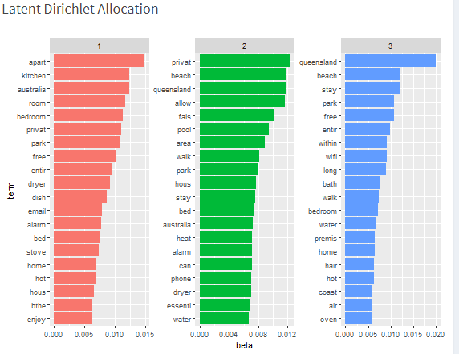

```{r, include=FALSE}
options(tinytex.verbose = TRUE)
```

# Introduction
_[The actual research paper itself should not more than 6 pages excluding figures, tables, formula and references.]_

Airbnb is an online marketplace platform for accomodation rental. Founded in 2008 by Brian Chesky and Joe Gebbia who had the idea to put an air mattress in their living room and offered bed & breakfast[@brandeduc2019] (thus “Airbnb”), the company has grown to be one of the most popular short-term accommodation rental platforms in multiple countries around the world.

With millions of listings in 220 countries and over 100,000 cities[@airbnb2020], Airbnb has a rich store of data from transactions between hosts and guests. Such data includes structured data like price, number of facilities (e.g. bedrooms, bathrooms), minimum and maximum number of nights’ stay; and unstructured text data like description of the accommodation, and reviews by guests.

# Motivation
_(Motivation of the application)_

Given the proven potential of the Airbnb model for hosts to offer their accommodations for rental, hosts would be keen to know how the potential for their listing to be successful in turning a profit.

However, analysts keen to delve into such data sets might not have the requisite knowledge in scraping Airbnb listing data from the web, nor the skills to develop their own analysis tools. This application aims to bridge this gap by providing a publicly available analysis dashboard that provides various analysis techniques such as Exploratory Data Analysis of the characteristics of listings, statistical clustering and spatial clustering analyses, sentiment analysis and multi-linear regression analysis.

The target users of this application are analysts with some knowledge of statistical techniques but lack the coding skills to develop their own tools.

It is hoped that this application would provide the target users with a useful statistical tool for their analysis.

# Review of past works
_(Review and critique on past works)_
There are currently a number of analyses that has been conducted on the Airbnb dataset. While most of them are focused on one particular country, given that the datasets made available by Inside Airbnb are rather consistent across different geographical space, it is reasonable to assume that the analytical methodologies adopted by these other studies can be easily replicated and reproduced with data from other countries.

One of most prominent and recent study on Airbnb data is by Steve Deane from Stratos, who wrote a blogpost in January 2021 on the topic (which also inspired this project). In his post, Deane provides descriptive statistics (e.g. total number of hosts, most popular destination, number of guests) focusing on the global distribution with a slight inclination towards the United States of America. While some of the statistics were provided, Deane’s analysis is heavily weighted towards the economic aspects of Airbnb (e.g. whether Airbnb affects property values and rents - “Airbnb effect”, whether Airbnb is cheaper than hotels, and economic impact of Airbnb in each country). However, Deane does not provide any higher level data analysis beyond the descriptive ones. He did presented one segment explaining the factors that host should consider when purchasing a property to use as an Airbnb - reflecting some form of explanatory analysis (and perhaps even predictive) but the content was scarce with no elaboration on how these factors were derived. The major ‘flaw’, though, remains the fact that Deane’s blog post is heavy on qualitative write-up with minimal (or no) meaningful visualization of the statistics he has quoted.

Several blog posts on medium.com provided basic guides on data analysis on the Airbnb dataset. Kwon et. al. (2018), Chen (2019), and Gedik (2020) are some recent examples.

Kwon et. al. (2018) used the Inside Airbnb listing data from Austin, Texas with around 12,000 listings, and utilized the numerical features to apply Linear Discriminant Analysis, Outliers were detected and removed using the Cook’s distance before a Box-Cox transformation was conducted to normalize the data, and the dependent variable (review score) binned to wrangle into categorical data type. Backward Elimination, Ordinal Logistic Regression, and LASSO Regression methods were employed to conduct explanatory analysis - with all three models turning number of bathrooms as significant predictor for customer ratings. Principal Component Analysis was then conducted with no good result after the model fail to meaningfully provide separation of classes (three classes). The Latent Discriminant Analysis was then conducted on each of the three classes resulted from the PCA. The study concluded that number of listings by hosts and having more bathrooms are crucial in securing higher review score. The advantage of this study is the depth, with detailed discussion on the methodology and results. However, the analysis focuses only on predictive/explanatory model, and is one-dimensional, studying only one dependent variable. The study does not offer interactive features to allow other forms of data exploration (e.g. other clustering methods, geographical influence) or changing of dependent variable (e.g. to examine factors affecting price of listing).

Chen (2019) on the other hand provides an analysis that emphasized on the geographical distribution of listings, and provided more data visualizations (playing to the advantage of using Tableau) that allow viewers to make quick noticeable trends. Chen analyzed the 2019 New York City listing data with the objective to predict future Airbnb performance in the city. However, while a predictive model was envisioned, there was little predictive analysis going on in her study - a greater emphasis was placed on qualitative inferences made via the visualization without proper data analytics methodologies. Chen was also limited in her methods of data visualization - for example, when presenting the geospatial distribution of areas by price, she had used a proportional dot map, without a convincing argument of its strength as compared to other visualization methods (such as a choropleth). In fact, the proportional size between the different dots are difficult to be differentiated based on her viz. There are also major flaws with other visualization choice (e.g. showing Average Price by Locations with equal-length bar differentiated by colors on a continuous scale), and the usefulness of some of the viz is also questionable (why might we be interested to know who are the Top 10 Busy Host, and indeed, what is the definition of ‘business’ here). All in all, while Chen presented some simple visualization to expose the potential of data viz using the Airbnb data, more is left desired from the analysis.

Comparatively, Gedik (2020) did a fair job in answering the questions set out by his objective. Using the Seattle listing dataset (via Kaggle), he aimed to find out the common amenities, and top features attracting guests and higher prices. In a Question-and-Answer format, Gedik presented visualizations to help answer each of the question he asked in a simple and succinct manner. In his third question, Gedik also presented the result table of a linear regression model he had ran, showing that property_type_Boat has the largest effect on price of listing. Gedik’s post, however, suffers from the limitation of scarce discussion in the technical methodology aspect. Similar to earlier studies, there is also no interactivity offered to allow viewers autonomy in changing parameters.

Amongst all, Gupta (2019) provided the most well-rounded discussion and presentation using the Airbnb listing data. Gupta aimed to provide an exploratory analysis of Airbnb’s data to understand the rental landscape in New York City. Gupta first employed descriptive time-series statistics to map out the increasing trends in number of listings and reviews in the city, before moving on to present an interactive Shiny App that provides information on individual listing based on sets of filters (e.g. max budget, number of people, minimum rating). While Gupta offered some form of interactivity, the Shiny does not provide any meaningful insights, and is essentially a replica of the user interface offered by Airbnb via the official website.

While non-interactive, Gupta’s subsequent discussion provides a preliminary view of the analytical methodologies that could be employed using the Inside Airbnb listing data. Firstly, he mapped out a geographical spread of the ratings and price by area using a Choropleth map (subsequent discussion in this paper will also conclude that it is indeed one of the better geospatial visualization option for this application). He also provided a quick bar-chart viz of the breakdown in terms of property types, before moving on to discuss the temporal nature and seasonality effect of price in New York City (using both a time series dot plot to analyse monthly patterns and a boxplot for each day of the week. He even employed a calendar heat map of occupancy within the city. After geospatial and temporal analysis, Gupta moved on to conduct text analytics on the reviews dataset to find words most commonly mentioned - an attempt to distil aspects that play important roles in shaping the Airbnb experience. A Shiny app was also developed to allow user to find similar word vectors based on a query word. Lastly, Gupta set out to find out whether there are any correlation between the host response rate, the average ratings, and whether the host is a Superhost. While no predictive model was used, the scatter plot presented provides a quick viz on the explanatory analysis he desired to conduct.

Within the industry, there exists interactive tools that allow analysts or potential hosts to analyze rental data using attributes and past performance. One such example is AIRDNA. Notwithstanding the fact that the platform only offers paid services, the results are also provided in a prescriptive manner with little analytical value-add.

# Design Framework
_(A detail description of the design principles used and data visualisation elements built (Refer to Section IV: Interface of [this paper](https://ink.library.smu.edu.sg/cgi/viewcontent.cgi?article=2760&context=sis_research).)_

The application makes use of the R stastical language which is open-source and offers many tried-and-tested packages for the type of analysis that the application will feature. The design considerations are as follows:  

1. Reproducibility of results by performing calculations within the application itself.  
2. Adoption of common R packages in the Comprehensive R Archive Network[@cran2021] (CRAN) for supportability.  
3. Use of the R Shiny package for interactivity and easy deployment.  
4. Offer interactive features for easy use.  

## Data Preparation
All data preparation was performing using R in the RStudio IDE. This included dropping columns from the data set that were irrelevant for the scope of our research, converting columns into the appropriate data types, and imputing NA values where appropriate.

## Exploratory Data Analysis
_(Can refer to Raymond Teo's paper: https://wiki.smu.edu.sg/1920t2isss608/Group11_research_paper and how they write this portion.)_

## Cluster Analysis
_(Can refer to Raymond Teo's paper: https://wiki.smu.edu.sg/1920t2isss608/Group11_research_paper and how they write this portion.)_

## Spatial Data Analysis  
The spatial data analysis provides an analytical overview of the geographical distribution of different variables of interest across the different Local Government Areas (LGAs) of Australia. For example, the choropleth below presents the median price of listing is in each of the LGAs in the Victoria State - the darker the color, the higher the median price for that LGA, and we see the darkest range of median price in the area around the tip of the Melbourne bay. This way, we can easily compare whether median prices are within the same range, higher, or lower across the different LGAs. 


The above visualization is achieved by merging the Airbnb listings data scrapped by Inside Airbnb (including the coordinates of each listing's geospatial position) with the LGA digital boundaries in ESRI Shaprefile format made available by the Australian Bureau of Statistics[@abs]. Firstly, six variables from the raw listing data (i.e.. price, count, ratings, number of reviews, acceptance and response rates) are summarized and grouped using the base R *summarise()* and *group_by()* modules into their LGAs to obtain aggregated variables.

Next, we import the shapefile using the *st_read* function from the *sf* package. We then left-join the summarized aggregated values onto the spatial dataframe.

Finally, we remove rows that have missing values from our data, filter data down to the state we are interested in (Victoria in this case) and then plot the viz using functions under the *tmap* package.  
Beyond the selection of state, the application also allows user to tweak the parameters, such as the variable of interest (6 in total) and binning methods. 

However, we also observed that there are LGAs of lower median price north of the bay Melbourne Bay area) and clusters of higher median prices (south-west of the bay). While good for overall distribution, the choropleth does not provide an objective view of how the variable (e.g. median price) of one LGA compares with the other LGAs around ir or across Australia. We hence aim to identify clusters based on variable of interest to identify "hot/cold spots" and outlier LGAs. To do this, we employ a Local Indicators for Spatial Autocorrelation (LISA) analysis, which helps to reveal clusters of LGAs/outliers based on their attributes. 

The first step to determining the local spatial autocorrelation is to determine what constitutes a neigboring area to consider and hence the spatial weight to be assigned for analyzing association. There are several ways to do this, categorized mainly into two types: (i) contiguity-based[@contiguityneigh] and (ii) distance-based[@distanceneigh]. (i) is further split into Queen's contiguity (with shared vertex - no shared border needed) and Rook's contiguity (smaller distance threshold; only shared borders), analogous to a chess board; (ii) is also further split into K's Nearest Neighbor (i.e. the K LGAs nearest to subject, centroid-to-centroid) and Distance-band (any area with centroid within a distance band radius from subject centroid). The neighbor spatial weights are derive using the respective modules within the *spdep* package. 

The resultant spatial weight and spatial dataframe is then used to derive the LISA - in this case, the Local Moran's I (note: Getis-Ord's G Z-score is also available; discussion and application is available via [this](https://onlinelibrary.wiley.com/doi/pdf/10.1111/j.1538-4632.1992.tb00261.x) and [this link](http://personal.tcu.edu/kylewalker/spatial-neighbors-in-r.html) respectively; the latter was used as a reference to develop this sub-module). We then use the *localmoran* function from the same *spdep* package to calculate the Local Moran's I statistics for each of the LGAs. The underlying formula is given as follows:


where x(i) is the variable of interest for LGA i, w(ij) the spatial weight with neighbor j, and x-bar the mean. The statistic is then tested for statistical significance - LGAs with statistically significant statistic rejects null hypothesis that they are no spatial associated with their neighbors - these LGAs are then further categorized into four classes based on their deviation from the mean. If an LGA's variable of interest is higher than its mean, it has a comparatively high value; if its local Moran's is higher than the statistic's mean, the neighbors also have high values - this thus presents a High-High cluster. A summary of the four clusters is presented below:


The resultant LISA analysis for median price in LGAs in the State of Victoria is as shown below. The areas shaded (regardless of which cluster/outlier the LGA belongs to) on the right-hand viz according to the confidence level selected (90%, the default, in the viz below) should correspond to the p-value of the left-hand viz (all the colored area has p-value corresponding to 90% confidence level and above). The methods of selecting neighbor and the confidence level for the statistical analysis can be varied according to user preference. 


## Sentiment Analysis
_(Can refer to Raymond Teo's paper: https://wiki.smu.edu.sg/1920t2isss608/Group11_research_paper and how they write this portion.)_

### Word Cloud
Word clouds are an effective way to represent the frequency that a word appears in a particular corpus (a collection of texts). For this application, the size of the word represents the relative frequency of the word in the description section of Airbnb listings. The word in the largest font is the most common word.

The first step to clustering is to create the corpus. This is done by scraping all the text from the desired column in the Airbnb data set - in this case, the description field. Once the corpus is created, tokenisation is done to clean up the words or terms and create a tibble of single terms in a column. Tokenisation includes removing extra white spaces from between terms, removing numbers (number do not have any meaning in a textual word cloud), punctuation symbols, and removing _stop words_ (which refer to words that have no meaning like "I", "a", "this", "and", etc), and stemming words (reducing words to their root like "walking" to "walk"). This cleaning process ensures that only valuable terms are included.

After tokenisation is performed, the corpus of words are transformed into a Document Term Matrix (DTM), which is a matrix of the frequency of each term in the corpus. Based on the DTM, the word cloud will generate the words according to their frequency.


_Figure 1: Word Cloud_

### Topic modelling using Latent Dirichlet Allocation
Topic modelling is a statisical model to identify topics in textual data. It is an unsupervised machine learning technique that detects word and phrase patterns in documents and clusters them into groups known as topics. The concept behind topic modelling is that different topics would have certain words appear together frequently. Based on this, topics can be discovered based on the words that appear frequently together.

The 2 common approaches to topic modelling are Latent Semantic Analysis (LSA) and Latent Dirichlet Allocation (LDA)[@git2016].

As described by Cvitanic, et al. [@git2016], LSA is a text analysis method that makes use of a semantic space (representations of natural language meant to identify meaning in language) to calculate or compute the similarity between words, phrases, sentences, paragraphs, or even whole documents. Similar to the word cloud, LSA makes use of a document term matrix to weight the words in terms of the frequency that they appear in the corpus.

LDA, according to Cvitanic, et al. [@git2016] was a topic modelling technique that evolved from LSA. The basic idea of LDA is that "documents are represented as random mixtures over latent topics, where each topic is characterized by a distribution over words."[@git2016] To be able to identify the topics in a corpus, a "generative process whereby the documents are created" is done so as to infer the topics[@wikilda2021]. This inference is done by imagining documents being random mixtures of terms with latent topics underlying them, where each topic has a unique distribution across all the words in the corpus[@wikilda2021]. LDA requires a defined number of topics as an input parameter.

In other words, LDA assumes that all words in the document can be assigned a probability of belonging to a topic. As such, the goal of LDA is to determine the mixture of topics that a document contains.

LDA was chosen at the topic modelling technique to implement in this application.

```{r, echo=FALSE, fig.cap="testing caption", fig.align='center', dpi=300, fig.width=12, fig.height=6}
#knitr::include_graphics("/images/wordcloud1.png")
```


_Figure 2: Topic Modelling using LDA_

## Multi-linear Regression Analysis
_(Can refer to Raymond Teo's paper: https://wiki.smu.edu.sg/1920t2isss608/Group11_research_paper and how they write this portion.)_

# Demonstration
_(Use case)_

## Spatial Data Analysis

This demonstration focuses on the LISA analysis for median price of listings in each LGAs within the regions of Victoria, Australia. Based on the LISA plot below (result of 90% confidence level, Queen's Continuity for spatial weight), we conclude with 90% confidence that the LGAs shaded has spatial association with the LGAs around them. 


We observed that there is an area of Low-High outliers (dark blue) in the north of the Melbourne Bay Area - these are outlier LGAs with lower median price as compared to their surrounding neighbors, which have higher median price for the Airbnb listings within. This is potentially driven by the largely tourist hotspot in the Melbourne area that drives Airbnb listing prices higher around the Low-High region we observed. 

On the other hand, we also notice two distinct High-High clusters in purple. These area reflects clusters or congregation of LGAs with higher median Airbnb listing prices. The cluster on the southwestern end of the bay area corresponds to the start point of the famous Great Ocean Road and is hence not a surprise to have wide-spread area of high accommodation prices. The cluster to the East, though, comprises of mainly smaller and more remote tourist spots such as the Swifts Creek - the fact that they are detected as a High-High cluster is a little unexpected. However, once we shift to take a look at the raw median price (see viz in Section 5.3), we notice that this is mainly due to the fact that surrounding LGAs typically have lower median price (since it is a remote area) - any minor hotspot that increases the median listing price slightly (though statistically significant) in LGAs of close proximity (each with one small attraction) would result in a "High-High" cluster. This is confirmed when we notice the raw median price of this cluster is of lower price range (ligher pink) than those in the Great Ocean Road area. 

## Sentiment Analysis
Sentiment analysis with this app consists of a word cloud and topic modelling using Latent Dirichlet Allocation (LDA). For this demonstration, the region of Victoria, Australia, is selected. The review scores range of 91 to 100 is also selected.

### Word Cloud
With the above filter selections, the word cloud created is shown below.


_Figure 3: Word Cloud_

It is not unexpected that the word "victoria" is the most common word in this word cloud, since the region in question here is Victoria. Some other common words are "kitchen", "park", "privat" (private), "bed, "bedroom", and "walk".

This would suggest that these words are common in the descriptions that hosts write about their listings, and these listings garner review score ratings of 91 and above, which is the highest decile of review scores. Thus for an Airbnb host who aims to obtain review score ratings within that range, they should include these words into their descriptions. Of course, the accommodation itself should actually offer these facilities so as not to dissapoint the guest, which would expectedly lead to lower rating scores.

### Topic Modelling
Similar to the word cloud,the region of Victoria, Australia, is selected with the review scores range of 91 to 100. The number of topics to be identified is three, with the top ten words of each topic presented in the visualisation.

With the above filter selections, the topic model is shown below.


_Figure 4: Topic Modelling using LDA_

The bar beside the corresponding word represents the probability (beta) of that word appearing in that particular topic. The longer the bar, the higher the probability.

Based on the top words in each topic we can identify the following topics:

- Topic 1: The word "garden" is very common in this topic (other than the word "victoria" which is the region in question). Along with "garden", other words like "phone", "washer", "essenti" (essentials), "room", "bedroom", "balconi" (balconies), "minut" (minutes) feature in the top 20 most common words in this cluster. This suggests that listing descriptions with these words tend to appeal to guests who stay in the accommodation more often, and enjoy facilities such as a garden, washer, balconies, etc. Such guests may be older persons who enjoy staying in the comforts of the house.


- Topic 2: Words common to topic 2 are "park", "kitchen", "dryer", "street", "walk" "washer", "wifi". These are some of the words in the list of top 20 most common words in this topic. This type of accommodation description may appeal more to younger guests who want Wi-Fi access in the accommodation, and also who might enjoy going outdoors to the park for a walk.

- Topic 3: The common words in this cluster are "park", "bath", "bed, "heat", "bedroom", "beach", "walk", "dryer". These terms may appeal to those who are looking to visit the beach during their stay.

# Discussion
_(What has the audience learned from your work? What new insights or practices has your system enabled? A full blown user study is not expected, but informal observations of use that help evaluate your system are encouraged.)_

The geospatial analysis allows audience to have a quick overview on the geographical distribution of a variable of interest (say, median price) across a selected level of detail (whole-of-Australia or individual LGA). The LISA analysis further adds on to this overview to allow identification of hotspots/coldspots (clusters of high/low value) and outliers (LGAs with abnomally high/low median price vis-a-vis its neighbors). User can form hypothesis about the spatial correlation between different variable of interest (e.g. price hotspots in Victoria corresponds to rating hotspots), where further confirmatory analysis can be conducted as an extension based on observations from this system. In fact, with the clusters and outliers identified, users can conduct deeper analysis on these areas using other tools available on this system (e.g. sentiment analysis, predictive analysis) to understand why these patterns formed. 

From the sentiment analysis, it was observed that most guests only gave a review score if they has a positive experience staying at the accommodation. As such, most of the review scores were in the range of 91 - 100. This caused a lack of data that could have highlighted what words in a listing description might cause garner low review score (claims of accommodation facilities that were not actually available, for example), or what topics might receive the same (these topics might reveal unpleasant sentiments for guests). However, it was still valuable to know what terms and topics were common in listings that garnered high review scores. Such insight would advise a potential host on what kind of words or accommodation facilities would appeal more to guests. In addition, different regions in Australia yield different results. For example, the word cloud for Queensland yielded the terms "Beach" and "park" as the 2nd and 3rd most common terms, while the word cloud for Queensland yielded only "park". This indicates that Queensland listings that garner high review scores are likely near a beach and made that explicit in the listing description, whereas listings in Victoria does not seem to have that, but still can highlight their proximity to parks.

# Future Work
_(A description of how your system could be extended or refined.)_

Future versions of such an application could include other countries to provide more comprehensive analysis of different regions and markets. FOr example, Airbnb listings in South Africa may provide different insight into what hosts provide and what guests want, compared to Australia or other countries.

Other sentiment analysis techniques such as LSA could be included, to provide the analyst with a more comprehensive suite of statistical analysis tools with which to perform their analysis.

Deeper analysis could also be done on the profile of hosts as well as guests, for example what type of hosts were more likely to have listings that gained good reviews, or what type of guests were more likely to match a certain type of listing and give good reviews.

On a whole-of-Australia scale, there are numerous LGAs with missing data. In order support a more robust and holistic geospatial association analysis, these information gaps will need to be plucked. 

# References

---
references:
-  id: abs
   title: 'Australian Statistical Geography Standard (ASGS): Volume 3 - Non ABS Structure'
   Author: Australian Bureau of Statistics
   URL: 'https://www.abs.gov.au/AUSSTATS/abs@.nsf/DetailsPage/1270.0.55.003June%202020?OpenDocument'
   type: digital source
   issued:
     year: 2020
     month: 6
-  id: brandeduc2019
   title: 'Airbnb Inc'
   Author: Brand Education
   URL: 'https://brand.education/airbnb-inc/'
   type: website
   issued:
     year: 2019
     month: 6
-  id: airbnb2020
   title: '2020 Airbnb Update'
   Author: Airbnb
   URL: 'https://news.airbnb.com/2020-update/'
   type: website
   issued:
     year: 2020
     month: 1
-  id: contiguityneigh
   title: 'Contiguity-Based Spatial Weight'
   Author: Luc Anselin
   URL: 'https://geoda.gitee.io/workbook/4a_contig_weights/lab4a.html'
   type: website
   issued:
     year: 2020
     month: 8
-  id: distanceneigh
   title: 'Distance-Based Spatial Weight'
   Author: Luc Anselin
   URL: 'https://geodacenter.github.io/workbook/4b_dist_weights/lab4b.html'
   type: website
   issued:
     year: 2018
     month: 3
-  id: cran2021
   title: 'The Comprehensive R Archive Network'
   Author: The Comprehensive R Archive Network
   URL: 'https://cran.r-project.org/'
   type: website
   issued:
     year: 2021
     month: 4
-  id: git2016
   title: 'LDA v. LSA: A Comparison of Two Computational Text Analysis Tools for the Functional Categorization of Patents'
   Author:
   - family: Cvitanic
     given: Toni
   - family: Lee
     given: Bumsoo
   - family: Song
     given: Hyeon Ik
   - family: Fu
     given: Katherine
   - family: Rosen
     given: David
   URL: 'http://ceur-ws.org/Vol-1815/paper4.pdf'
   type: paper
   issued:
     year: 2016
     month: 1
-  id: wikilda2021
   title: 'Latent Dirichlet allocation'
   Author: Wikipedia
   URL: 'https://en.wikipedia.org/wiki/Latent_Dirichlet_allocation'
   type: webpage
   issued:
     year: 2021
     month: 4
...

