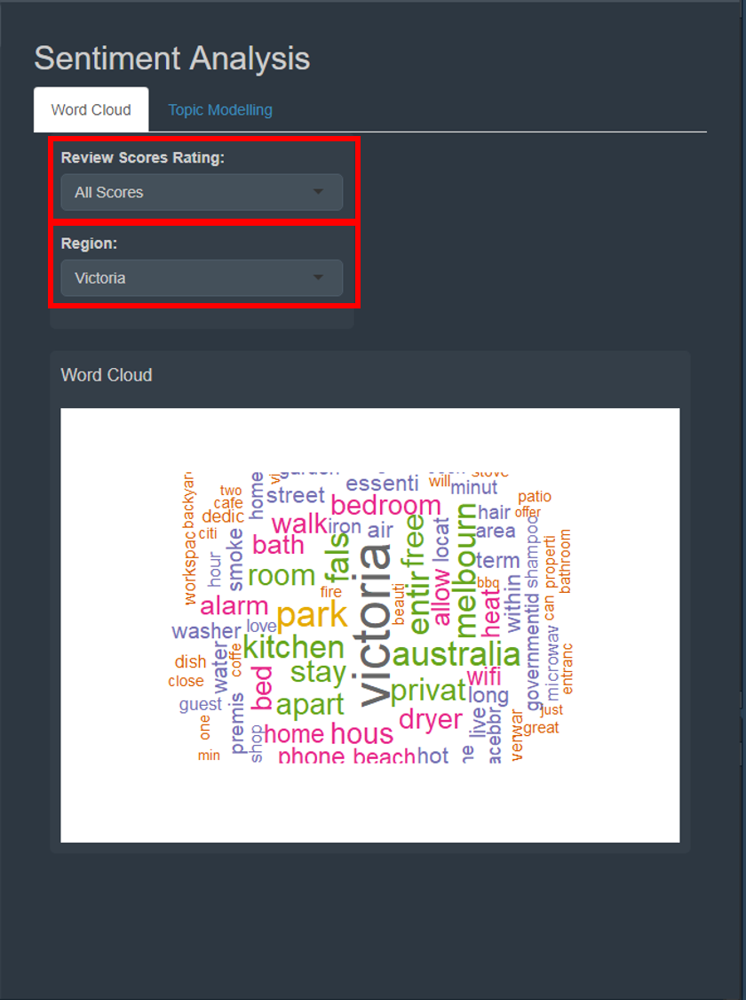
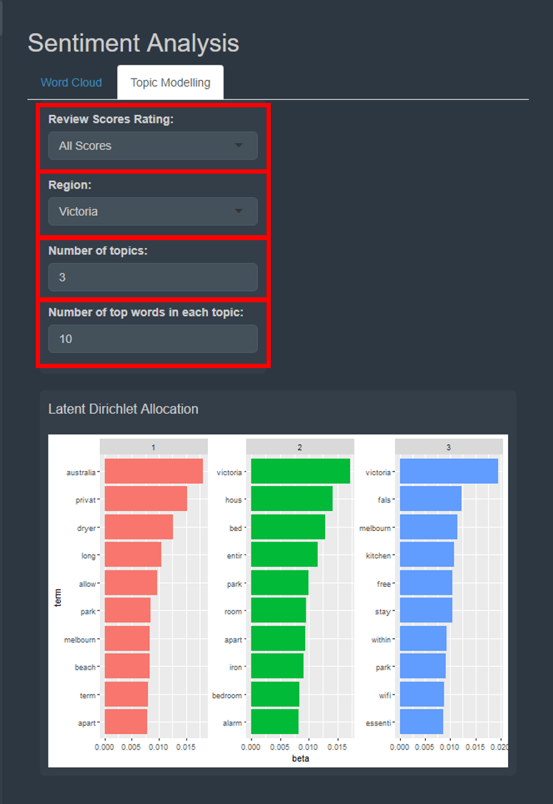

```{r, include=FALSE}
options(tinytex.verbose = TRUE)
```

# Introduction Page
Lorem ipsum

# Exploratory Data Analysis (EDA)
Exploratory Data Analysis allows you to perform initial investigation on the data, so that you may be able to discover patterns, and explore the different variables in the data set. It will allow us to formulate hypothesis and explore different statistics models that could be developed after.

## Bar Charts

- Click on *"Region:"* to explore the different states in Australia
- Click on *"X Variable:"* to explore *"Number of Hosts"* and *"Number of Listings"* in various different States.

The top barchart showcases the *"X Variable"* per State.

The bottom barchart showcases the *"X Variable"* per top 10 Local Government Area per State.

## Boxplots

- Click on *"Region:"* to explore the different states in Australia.
- Click on *"Local Government Area"* to explore the different cities in the State. You are able to choose multiple cities to view at a single time through clicking the chosen city in the drop down bar.
- Click on *"Y Variable:"* to view the boxplots of different variables such as *Price, Review Scores Ratings, Bedrooms, Beds* etc.

The top boxplot showcases Boxplots of *"Y Variable"* against the Local Government Area.

The bottom boxplot showcases *"Price"* vs *"Property Type"* with a Facet Wrap of Local Government Area.

## Bivariate Analysis

- Click on *"Region:"* to explore the different states in Australia.
- Click on *"Local Government Area"* to explore the different cities in the State. You are able to choose multiple cities to view at a single time through clicking the chosen city in the drop down bar.
- Click on *"X Variable:"* and *"Y Variable:"* to view the bivariate plot with different variables such as *Price, Review Scores Ratings, Bedrooms, Beds* etc. This will allow us to explore how 2 variables interact with each other

The top plot is a density plot to showcase the density of the *"X Variable"*.

The bottom plot is a bivariate plot to explore the relationship between 2 variables.

The two tables below the bivarate plots showcase the confidence interval of the *"X Variable"* and *"Y Variable:"*.

## Correlation Analysis

- Click on *"Visualisation Method:"* to view the correlation plots in different methods such as *"circle, ellipse and number"*.
- Click on *"Reorder Correlation Matrix:"* to view the correlation plots in different orders such as *"hclust, alphabet and AOE"*.

The plot represents the correlation plot of all the variables in the Airbnb data set.

# Cluster Analysis

- Click on *"Region:"* to explore the different states in Australia.
- Click on *"Cluster Variable:"* to explore the different variables you would like to cluster. Types of variables are *"Price, Bedrooms, Beds, Review Score Ratings"* etc. You are also able to click to choose more variables that would be used for clustering.
- Click on *"Distance Function:"* to choose between *"euclid"* and *"cosine"* distance for the clusters.
- Toggle *"Cluster Size"* between the sizes 2 and 15, to see different cluster sizes in the data set.

The first plot is the kmeans plot. it showcases the different cluster sizes.

The second plot is an Optimal Cluster Plot, that gives you an indication the number of clusters that will be best for the data set used.

The third plot is a parallel plot that showcases the relationship of the variables and the clusters. It gives an indication of the characteristics of the cluster that was formed.

# Geospatial Data Visualization and Analysis
Lorem ipsum

# Sentiment Analysis
The sentiment analysis module of this Shiny app includes two analysis models: a word cloud and a topic model.

## Word Cloud</br>

Select the range of review scores rating that you would like to focus on. By default, all scores are selected.

You can also select which region of Australia you want to focus on.

The word cloud will be generated. The size of the font represents the relative frequency of the word in the description section of  Airbnb listings that fall in the category of the filter settings above (the word in the largest font is the most common word).

{width=60%}

## Topic Modelling</br>

Topic modeling is an unsupervised machine learning technique that detects word and phrase patterns in documents and clusters them into groups known as topics.

Latent Dirichlet Allocation (LDA) is one common topic modeling technique. The basic assumption of LDA is that similar topics make use of similar words (i.e. distributional hypothesis). The purpose of LDA is to map the corpus to topics covering a significant number of words in the documents in the corpus.

LDA assigns topics to arrangements of words for example, the best word for a topic related to accommodation. This is based on the assumption that documents are written with a certain arrangement of words and that those arrangements will determine the topics. LDA assumes that all words in the document can be assigned a probability of belonging to a topic. As such, the goal of LDA is to determine the mixture of topics that a document contains.

Similar to the word cloud, select the range of review scores rating that you would like to focus on. By default, all scores are selected.

You can also select which region of Australia you want to focus on.

In addition, select how many topics you want to be identified. By default, the number of topics is 3.

Next, select the number of words you want presented in each topic. The default number of words is 10.

The LDA topic model will be generated. The bar beside the corresponding word represents the probability (beta) of that word appearing in that particular topic. The longer the bar, the higher the probability.

{width=60%}