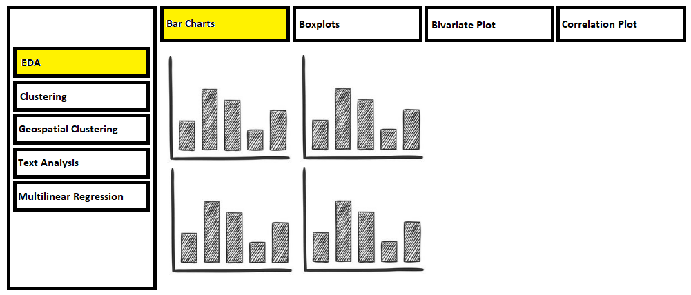
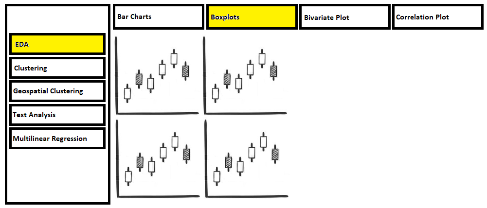
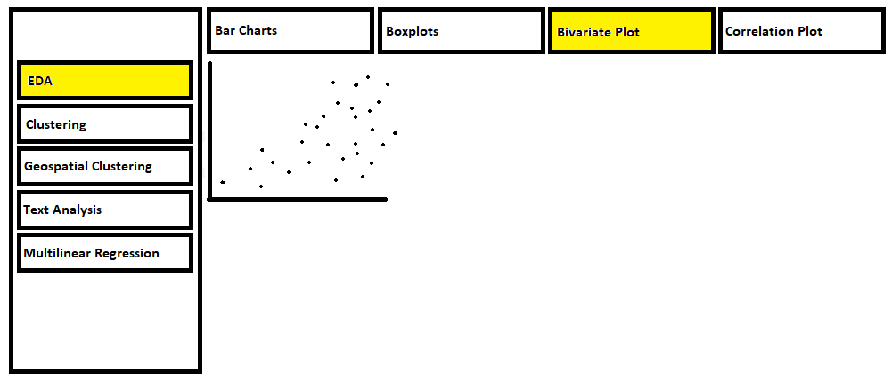
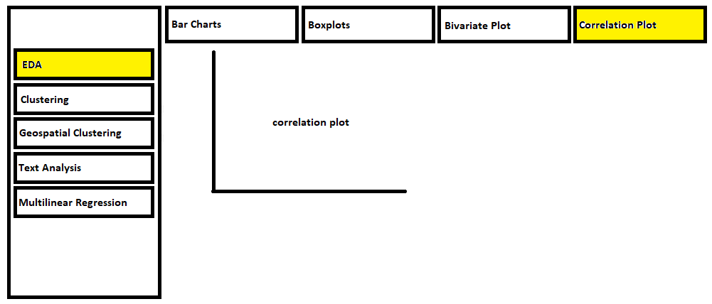
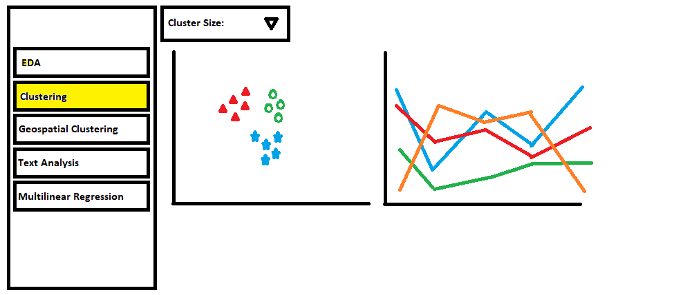
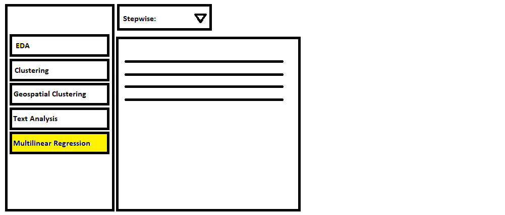

```{r setup, include=FALSE}
knitr::opts_chunk$set(echo = TRUE,
                      fig.retina = 3, 
                      message = FALSE,
                      warning = FALSE)
```

Conducting literature review on how the analysis were performed before. The focus should be on identifying gaps whereby interactive web approach and visual Analytics techniques can be used to enhance user experience on using the analysis techniques.

Preparing the storyboard for the design of the sub-module.

Extracting, wrangling and preparing the input data required to perform the analysis. The focus should be on exploring appropriate tidyverse methods

Testing and prototyping the proposed sub-module in R Markdown. The R Markdown document must be in full working html report format. This link provides a useful example for your reference.

------
# Sketch of Proposed Visualisation

```{r, echo=FALSE, fig.cap="Sketch for Proposed Visualisation", fig.align='center',layout="l-body-outset",dpi=300, fig.width=10, fig.height=6}






```

# Installing and launching R packages

These are the list of packages that will be used for this assignment, in RStudio.

```{r}
packages <- c("tidyverse", "plotly", "purrr", "dplyr", "gdata", "corrplot", "MASS", "biganalytics", 
              "parallelPlot", "factoextra", "factoextra", "gridExtra", "cluster", "forcats")

for (p in packages){
  if (!require(p,character.only=T)){
    install.packages(p)
  }
  library(p, character.only=T)
}
```

# Datasource

The data set used in this assignment is found in website *Inside Airbnb* http://insideairbnb.com/get-the-data.html
It is a website that obtains data that is sourced from publicly available information from the Airbnb site. For this assignment, we will be concentrating on the country *Australia*, in the region *Victoria*.

# Loading Dataset onto R
Both the Airbnb data set for Australia and Airbnb data set for the State of Victoria will be loaded.

``` {r}
airbnb <- read_csv("data/Airbnb.csv")
airbnb.vic <- read_csv("data/Airbnb_victoria.csv")
str(airbnb, nchar.max=20)

```

# Exploratory Data Analysis

First, we will create some simple bar charts, boxplots, scatterplots and density plots to be able to explore the different variables in the data set. It will allow us to formulate hypothesis and explore different statistics models that could be developed after.

Below are a few plots to be incorporated into the Shiny App. Users will be able to toggle different variables for the different charts to explore the data.

Barchart allows us to visualise the Top States and top Local Government Area for the count of host and listings.

## Number of Hosts per State

```{r}
unique_host_id_aus <- airbnb %>%
  dplyr::select(host_id, region_parent_name) %>%
  unique() %>%
  mutate(hostcount=1)%>%
  dplyr::select(-host_id)%>%
  group_by(region_parent_name)%>%
  count(hostcount, name="number.of.host")%>%
  ungroup() %>% 
  dplyr::select(-hostcount)%>%
  arrange(desc(number.of.host))
  
b<-ggplot(unique_host_id_aus,aes(x=(reorder(region_parent_name,-number.of.host)),y=number.of.host))+
  geom_col() +
  labs(title= "Number of Hosts per State", x="State", y="Number of Hosts")+
  theme(legend.position="bottom", axis.text.x = element_text(angle = 90))
  
```

## Number of Hosts in the top 10 Local Government Area (LGA)

```{r}
unique_host_id <- airbnb.vic %>%
  dplyr::select(host_id, region_name) %>%
  unique() %>%
  mutate(hostcount=1)%>%
  dplyr::select(-host_id)%>%
  group_by(region_name)%>%
  count(hostcount, name="number.of.host")%>%
  ungroup() %>% 
  dplyr::select(-hostcount)%>%
  arrange(desc(number.of.host))%>%
  slice_head(n=10)
  
b1<-ggplot(unique_host_id,aes(x=(reorder(region_name,-number.of.host)),y=number.of.host))+
  geom_col() +
  labs(title= "Number of Hosts in Top 10 LGA", x="LGA", y="Number of Hosts")+
  theme(legend.position="bottom", axis.text.x = element_text(angle = 90))
  
```
## Number of Airbnb Listings per State

```{r}
unique_id_aus <- airbnb %>%
  dplyr::select(id, region_parent_name) %>%
  unique() %>%
  mutate(idcount=1)%>%
  dplyr::select(-id)%>%
  group_by(region_parent_name)%>%
  count(idcount, name="number.of.listings")%>%
  ungroup() %>% 
  dplyr::select(-idcount)%>%
  arrange(desc(number.of.listings))
  
b2<-ggplot(unique_id_aus,aes(x=(reorder(region_parent_name,-number.of.listings)),y=number.of.listings))+
  geom_col() +
  labs(title= "Number of Listings per State", x="State", y="Number of Airbnb Listings")+
  theme(legend.position="bottom", axis.text.x = element_text(angle = 90))
  
```

## Top 10 LGA - Number of Airbnb Listings

```{r fig.height=12, fig.width=16}
unique_id <- airbnb.vic %>%
  dplyr::select(id, region_name) %>%
  unique() %>%
  mutate(idcount=1)%>%
  dplyr::select(-id)%>%
  group_by(region_name)%>%
  count(idcount, name="number.of.listings")%>%
  ungroup() %>% 
  dplyr::select(-idcount)%>%
  arrange(desc(number.of.listings))%>%
  slice_head(n=10)
  
b3<-ggplot(unique_id,aes(x=(reorder(region_name,-number.of.listings)),y=number.of.listings))+
  geom_col() +
  labs(title= "Number of Listings in the Top 10 LGA", x="LGA", y="Number of Airbnb Listings")+
  theme(legend.position="bottom", axis.text.x = element_text(angle = 90))

grid.arrange(b, b1, b2, b3, nrow = 2)
  
```


## Boxplots of Prices in the Top 10 LGA (Airbnb Listings)

We will plot Box plots to compare the prices in different states. We note that Morrington Penninsula has the most expensive prices in Australia.

Next, we will plot different boxplots for the State of Victoria, and compare prices versus type of property type. We note that Entire House in Surf Coast is the priciest in Victoria.

```{r}

#boxplots

cities<-unique_id$region_name

eda_boxplot<-airbnb.vic %>%
  filter(region_name %in% cities)%>%
  dplyr::select(region_name,price)
  

ggplot(eda_boxplot, aes(x=region_name,y=price))+
  geom_boxplot()+
  theme(legend.position="bottom", axis.text.x = element_text(angle = 90))+
  labs(title= "Top 10 LGA - Boxplot of Prices", x="", y="Prices")

```
## Top 10 LGA - Boxplot of Prices per Property Type

```{r fig.height=10, fig.width=12}
#boxplots of property types and prices

cities<-unique_host_id$region_name

property.type.focus <- airbnb.vic%>%
  dplyr::select(property_type)%>%
  group_by(property_type)%>%
  count(property_type,name="total.no.property")%>%
  ungroup()%>%
  arrange(-total.no.property)%>%
  slice_head(n=5)

eda_boxplot_propertytype<-airbnb.vic %>%
  filter(region_name %in% cities)%>%
  filter(property_type %in% property.type.focus$property_type)%>%
  dplyr::select(region_name,price,property_type)
  

ggplot(eda_boxplot_propertytype, aes(x=property_type,y=price))+
  geom_boxplot()+
  theme(legend.position="bottom", axis.text.x = element_text(angle = 90))+
  labs(title= "Boxplot of Prices by Property Type", x="", y="Prices")+
  facet_wrap(~region_name)


```
# Scatter plot

A Density plot is drawn up to identify where most of the reviews lie

A Bivariate plot is plotted to compare the relationship between 2 variables. We have filtered it down towards review scores above 80, as the density plot has indicated that most of the reviews are in that particular range.

## Density Plot of Review Scores for Entire House

``` {r fig.height=6, fig.width=12}

unique_id2 <- airbnb.vic %>%
  dplyr::select(id, region_name) %>%
  unique() %>%
  mutate(idcount=1)%>%
  dplyr::select(-id)%>%
  group_by(region_name)%>%
  count(idcount, name="number.of.listings")%>%
  ungroup() %>% 
  dplyr::select(-idcount)%>%
  arrange(desc(number.of.listings))%>%
  slice_head(n=5)

cities2<-unique_id2$region_name

densityplot<- airbnb.vic%>%
  filter(region_name %in% cities2)%>%
  filter(property_type == c("Entire house","Entire apartment")) %>%
  dplyr::select(price,review_scores_rating,region_name,property_type)

d1<-ggplot(densityplot,aes(review_scores_rating))+
  geom_density()+
  labs(title= "Density Plot of Review Scores for Entire House", x="Review Scores", y="")

``` 
## Bivariate Plot - Review Scores vs Prices for Entire House

``` {r fig.height=10, fig.width=12}
#bivariate prices vs reviews

bivariateplot<- airbnb.vic%>%
  filter(region_name %in% cities2)%>%
  filter(property_type == c("Entire house","Entire apartment")) %>%
  dplyr::select(price,review_scores_rating,region_name,property_type)%>%
  filter(review_scores_rating>80)

d2<-ggplot(bivariateplot,aes(review_scores_rating,price,color=region_name))+
  geom_jitter()+
  labs(title= "Review Scores vs Prices for Entire House", x="Review Scores", y="Prices")+ 
  geom_smooth(method='lm', formula= y~x, se = FALSE)+ 
  theme(legend.position="bottom")

grid.arrange(d1, d2, nrow = 2)

``` 

# Correlation Plot

A correlation plot is drawn to choose variables with low correlation for the multilvariate linear regression.

``` {r fig.height=10, fig.width=10}
#correlation plot

airbnb.cor <- dplyr::select(airbnb.vic,c(11, 12, 15, 24, 26, 27, 29,30,31, 43, 48, 49, 50, 51, 52, 53, 54, 61,65))
airbnb.cor2 <- cor(airbnb.cor,use = "complete.obs")
corrplot(airbnb.cor2,
         method = "ellipse",
         type="lower",
         diag = FALSE,
         tl.col = "black",
         order = "hclust")
```
# Multivariate Linear Regression

A Multivariate Linear Regression is created with Backwards, forwards and both stepwise regression. Users will be able to choose their variables from the correlation plot, to run the regression.

``` {r}

airbnb.mlr <- dplyr::select(airbnb.vic,c(11, 12, 15, 24, 26, 27, 29,30,31, 43, 48, 49, 50, 51, 52, 53, 54, 61,65))
variablesxMlr<-c("price", "host_response_rate", "host_acceptance_rate", "host_total_listings_count", "accommodates", "bedrooms", "beds","minimum_nights","maximum_nights", "number_of_reviews", "review_scores_rating", "review_scores_accuracy", "review_scores_cleanliness", "review_scores_checkin", "review_scores_communication", "review_scores_location", "review_scores_value", "region_id","reviews_per_month")

Rdata = airbnb.mlr[,variablesxMlr]
  Rdata<-na.omit(Rdata)
    fit1<-lm(price ~.,data=Rdata)
    fit2<-lm(price ~1,data=Rdata)
    
```
## MLR - Backward Stepwise
```{r}
    
step<- stepAIC(fit1,direction = "backward")
summary(step)

```
## MLR - Forward Stepwise
```{r}

stepforward<- stepAIC(fit2,direction = "forward",scope = list(upper = fit1,lower = fit2))
summary(stepforward)

```
## MLR - Both Stepwise
```{r}

stepboth<- stepAIC(fit2,direction = "both",scope = list(upper = fit1,lower = fit2))
summary(stepboth)

```

# Clustering

We will perform kmeans clustering with different cluster sizes, and determine the optimal cluster sizes.

``` {r fig.height=8, fig.width=12}
airbnb.vic2 <- airbnb.vic %>%
  dplyr::select(id, price, bedrooms, beds, review_scores_rating)%>%
  na.omit()%>%
  column_to_rownames(var = "id")  

df <- airbnb.vic2
df <- scale(df)

k2 <-bigkmeans(df, centers=2, iter.max = 99, nstart = 1, dist = "euclid")
k3 <-bigkmeans(df, centers=3, iter.max = 99, nstart = 1, dist = "euclid")
k4 <- bigkmeans(df, centers=4, iter.max = 99, nstart = 1, dist = "euclid")
k5 <- bigkmeans(df, centers=5, iter.max = 99, nstart = 1, dist = "euclid")
k6 <- bigkmeans(df, centers=6, iter.max = 99, nstart = 1, dist = "euclid")
k7 <- bigkmeans(df, centers=7, iter.max = 99, nstart = 1, dist = "euclid")

# plots to compare
p1 <- fviz_cluster(k2, geom = "point", data = df) + ggtitle("k = 2")
p2 <- fviz_cluster(k3, geom = "point",  data = df) + ggtitle("k = 3")
p3 <- fviz_cluster(k4, geom = "point",  data = df) + ggtitle("k = 4")
p4 <- fviz_cluster(k5, geom = "point",  data = df) + ggtitle("k = 5")
p5 <- fviz_cluster(k6, geom = "point",  data = df) + ggtitle("k = 6")
p6 <- fviz_cluster(k7, geom = "point",  data = df) + ggtitle("k = 7")

grid.arrange(p1, p2, p3, p4, p5, p6, nrow = 2)

```

## Determining Optimal Clusters - Elbow Method

```{r}

###Determining Optimal Clusters - Elbow method

set.seed(123)

# function to compute total within-cluster sum of square 
wss <- function(k) {
  kmeans(df, k, nstart = 10 )$tot.withinss
}

# Compute and plot wss for k = 1 to k = 15
k.values1 <- 1:15

# extract wss for 2-15 clusters
wss_values <- map_dbl(k.values1, wss)

plot(k.values1, wss_values,
     type="b", pch = 19, frame = FALSE, 
     xlab="Number of clusters K",
     ylab="Total within-clusters sum of squares")

```

## Determining Optimal Clusters - Silhouette Method

#```{r}

### Determining Optimal Clusters - Silhouette method

# function to compute average silhouette for k clusters
avg_sil <- function(k) {
  km.res <- kmeans(df, centers = k, nstart = 25)
  ss <- silhouette(km.res$cluster, dist(df))
  mean(ss[, 3])
}

# Compute and plot wss for k = 2 to k = 15
k.values2 <- 2:15

# extract avg silhouette for 2-15 clusters
avg_sil_values <- map_dbl(k.values2, avg_sil)

plot(k.values2, avg_sil_values,
     type = "b", pch = 19, frame = FALSE, 
     xlab = "Number of clusters K",
     ylab = "Average Silhouettes")


#```

## Determining Optimal Clusters - Gap Method

#```{r}
###Determining Optimal Clusters - Gap Method
# compute gap statistic
set.seed(123)
gap_stat <- clusGap(df, FUN = kmeans, nstart = 25,
                    K.max = 6, B = 50)
# Print the result
print(gap_stat, method = "firstmax")
fviz_gap_stat(gap_stat)

#```

# Parallel Plot

We will create a parallel plot to visualise the optimal cluster size and characteristics of each cluster.

```{r fig.height=12, fig.width=12}
# Add cluster to dataset
airbnb.vic2$cluster <- k4$cluster
airbnb.vic2$cluster <- as_factor(airbnb.vic2$cluster)

# Draw Parallelplot
parallelPlot(airbnb.vic2,refColumnDim = "cluster")
  
```