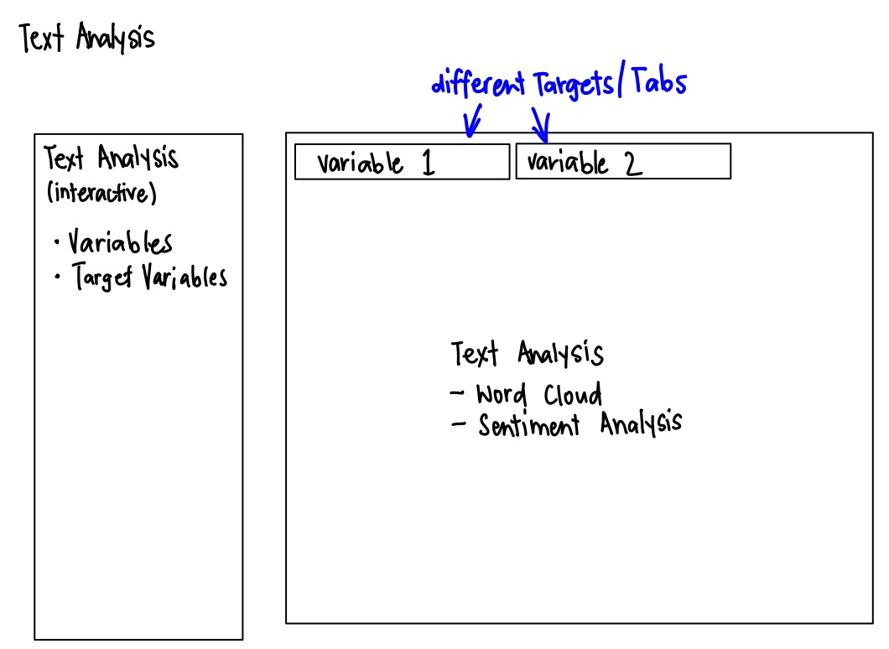

```{r setup, include=FALSE, eval=FALSE}
knitr::opts_chunk$set(echo = TRUE)
```
# 1.0 Introduction
Text analysis has been done on Airbnb data sets, but typically not in an interactive manner.

# 2.0 Literature Review of current analysis of Airbnb listings.
Text analysis has been done on Airbnb data sets, but typically not in an interactive manner. Most of these are written in Python and makes use of Python tools like VADER (*V*alence *A*ware *D*ictionary and s*E*ntiment *R*easoner) for sentiment analysis. The typical exploratory analysis conducted for text analytics, other than sentiment analysis, include correlations between accommodation facilities, correlation analysis on price versus actual value, word cloud presenting common terms used in listing reviews, It is usually reported as graphs and explained by the author, but does not allow the user to manipulate the graphs for customised analysis. Some examples [here](https://medium.com/analytics-vidhya/airbnb-data-analysis-43554ec39832) and [here](https://medium.datadriveninvestor.com/making-models-airbnb-price-prediction-data-analysis-15b9af87c9d8).

This assignment attempts to create a visualisation of text analysis of Airbnb listings, which will allow the user to manipulate variables to be able to customise the view to his/her preference.

# 3.0 Storyboard
{width=100%}

# 4.0 Data preparation

### Step 1: Load the required R packages

```{r Loading the required R packages}
packages = c('tidyverse', 'stringr', 'dplyr', 'lubridate', 'anytime', 'shiny', 'shinydashboard', 'plotly', 'corrplot', 'heatmaply', 'tidytext', 'tm', 'SnowballC', 'wordcloud', 'topicmodels')
for (p in packages){
if(!require(p, character.only = T)){
install.packages(p)
}
library(p, character.only = T)
}
```


### Step 2: Load the data 

```{r, eval=FALSE}
airbnb_raw <- read_csv("data/listings.csv")
```

### Step 3: Select the relevant columns of data


Many of the columns are not relevant to the analysis. As such, only columns relevant to the analysis are selected.


```{r, eval=FALSE}
airbnb <- select(airbnb_raw, c(1, 6, 7, 8, 10, 13, 14, 15, 16, 17, 18, 19, 23, 24, 25, 26,
                               27, 28, 29, 30, 31, 32, 33, 35, 36, 37, 38, 39, 40, 41, 42,
                               43, 44, 45, 46, 47, 49, 50, 51, 52, 53, 55, 56, 57, 58, 59,
                               60, 61, 62, 63, 64, 65, 66, 68, 69, 70, 71, 72, 73, 74, 75,
                               76, 77, 80))
```

### Step 4: Convert Date Variables from Character to Date Type

```{r, eval=FALSE}
airbnb$host_since <- as.Date(airbnb$host_since, format = '%d/%m/%Y')
airbnb$first_review <- as.Date(airbnb$first_review, '%d/%m/%Y')
airbnb$last_review <- as.Date(airbnb$last_review, '%d/%m/%Y')
```

### Step 5: Convert Rate variables from Character to Number Type

```{r, eval=FALSE}
airbnb$host_response_rate <- ((as.numeric(str_remove_all(airbnb$host_response_rate, "%")))/100)
airbnb$host_acceptance_rate <- ((as.numeric(str_remove_all(airbnb$host_acceptance_rate, "%")))/100)
```

### Step 6: Convert Price variables from Character to Numeric type

```{r, eval=FALSE}
airbnb$price <- as.numeric(gsub("\\$","", airbnb$price))
```

### Step 7: Replace String "N/A"s with NA

```{r, eval=FALSE}
airbnb$host_response_time <- na_if(airbnb$host_response_time, "N/A")
```

### Step 8: Save cleaned dataset as "Airbnb.csv"

```{r, eval=FALSE}
write.csv(airbnb, "data/Airbnb.csv")
```

# 5.0 Prototyping
#Load Data

## read in Airbnb.csv
```{r, warning = FALSE, message = FALSE}
airbnb <- read_csv("data/Airbnb_victoria.csv")
```

# Preparing the data for airbnb
## tokenisation to create a tibble of text from 'description' column
```{r}
airbnb_desc <- airbnb$description
airbnb_text <- iconv(airbnb_desc, to = "UTF-8")
airbnb_tibble <- tibble(airbnb_text)
airbnb_tibble %>%
  unnest_tokens(word, airbnb_text)
```

## Create a corpus and tokenisation
```{r, warning = FALSE, message = FALSE}
# creating the corpus
airbnb_corpus <- Corpus(VectorSource(airbnb_tibble))

# tokenisation
#remove white spaces between text
airbnb_corpus_clean <- tm_map(airbnb_corpus, stripWhitespace)
#transform all characters to lowercase
airbnb_corpus_clean <- tm_map(airbnb_corpus_clean, content_transformer(tolower))
#remove numbers
airbnb_corpus_clean <- tm_map(airbnb_corpus_clean, removeNumbers)
#remove punctuation
airbnb_corpus_clean <- tm_map(airbnb_corpus_clean, removePunctuation)
#remove common words that do not add value to sentiment analysis
airbnb_corpus_clean <- tm_map(airbnb_corpus_clean, removeWords, c((stopwords("english")), "%br"))
#cut words to their root form
airbnb_corpus_clean <- tm_map(airbnb_corpus_clean, stemDocument)
```

#create the Document Term Matrix
```{r}
airbnb_corpus_dtm <- DocumentTermMatrix(airbnb_corpus_clean)
```

#Creating the visualisations

## Wordcloud
```{r, warning = FALSE, message = FALSE}
sums <- as.data.frame(colSums(as.matrix(airbnb_corpus_dtm)))
sums <- rownames_to_column(sums) 
colnames(sums) <- c("terms", "count")
sums <- arrange(sums, desc(count))
head <- sums

#wordcloud will show the most common terms used in the 'description' column
wordcloud(words = head$terms, freq = head$count, min.freq = 100,
  max.words=1000, random.order=FALSE, rot.per=0.35, 
  colors=brewer.pal(8, "Dark2"))
```

Further analysis can be done by filtering on review scores to 

## Topic modelling using Latent Dirichlet Allocation (LDA) model
```{r, warning = FALSE, message = FALSE}
airbnb_lda <- LDA(airbnb_corpus_dtm, k = 5)
#> A LDA topic model with k topics.
```

## extracting the per-topic-per-word probabilities β (beta)
```{r, warning = FALSE, message = FALSE}
airbnb_topics <- tidy(airbnb_lda, matrix = "beta")
```

## visualise the topics
```{r, warning = FALSE, message = FALSE}
## find the 10 most common terms within each topic
airbnb_top_terms <- airbnb_topics %>%
  group_by(topic) %>%
  top_n(10, beta) %>%
  ungroup() %>%
  arrange(topic, -beta)

## visualising the output
airbnb_top_terms %>%
  mutate(term = reorder_within(term, beta, topic)) %>%
  ggplot(aes(beta, term, fill = factor(topic))) +
  geom_col(show.legend = FALSE) +
  facet_wrap(~ topic, scales = "free") +
  scale_y_reordered()
```

Deeper analysis can be done by filtering the review scores to show for example, reviews with a score of 90 and more, reviews with a score of a score of 10 and less, and both of these ranges to see what texts are common to both. This can be done easily in the Shiny app, using code similar to the below (but allowing the user to manipulate the values from the Shiny app):

```{r, warning = FALSE, message = FALSE}
#To filter the reviews with a score of 90 and more:
#airbnb_filter_top <- airbnb %>% filter(review_scores_rating >= '90')

#To filter the reviews with a score of 10 and less:
#airbnb_filter_bottom <- airbnb %>% filter(review_scores_rating <= '10')

#To filter the reviews of both ranges:
#airbnb_filter_top_bottom <- airbnb %>% filter(review_scores_rating >= '90' & review_scores_rating <= '10')
```