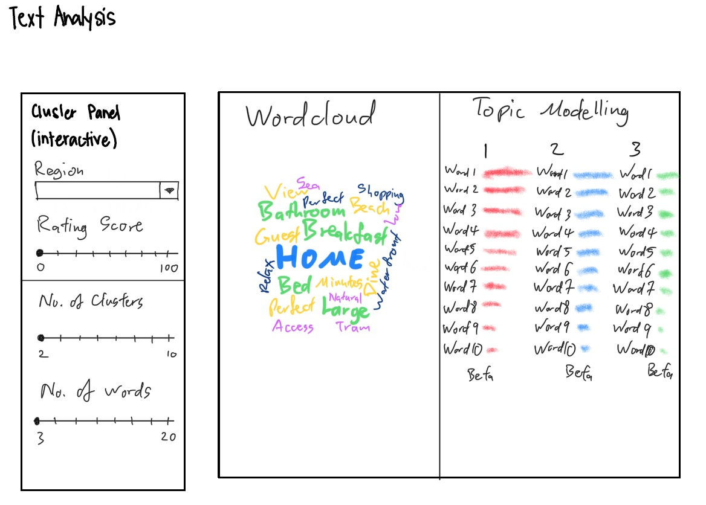

```{r setup, include=FALSE, eval=FALSE}
knitr::opts_chunk$set(echo = TRUE)
```

# The assignment
[This assignment](https://wiki.smu.edu.sg/2021t2isss608/Assignment) is part of the bigger Shiny-based Visual Analytics Application (Shiny-VAA) project. Each team member is required to select a sub-module from the proposed Shiny-VAA and to complete the tasks below:

1. Conducting literature review on how the analysis were performed before. The focus should be on identifying gaps whereby interactive web approach and visual analytics techniques can be used to enhance user experience on using the analysis techniques.
2. Preparing the storyboard for the design of the sub-module.
3. Extracting, wrangling and preparing the input data required to perform the analysis. The focus should be on exploring appropriate tidyverse methods
4. Testing and prototyping the proposed sub-module in R Markdown. The R Markdown document must be in full working html report format. This link provides a useful example for your reference.

# 1 - Introduction
[Airbnb](https://www.airbnb.com/) is an online marketplace platform for accomodation rental. [Founded in 2008](https://en.wikipedia.org/wiki/Airbnb) by Brian Chesky and Joe Gebbia who put an air mattress in their living room and offered bed & breakfast (thus "Airbnb"), the company has grown to be one of the most popular short-term accomodation rental platforms in multiple countries around the world.

With [millions of listings in 220 countries and over 100,000 cities](https://news.airbnb.com/2020-update/), Airbnb has a rich store of data from transactions between hosts and guests. Such data includes structured data like price, number of facilities (e.g. bedrooms, bathrooms), minimum and maximum number of nights' stay; and unstructured text data like description of the accommodation, and reviews by guests.

This assignment focuses on analysis of unstructured text data from Airbnb's online marketplace.

# 2 - Literature review of current analysis of Airbnb listings
Multiple attempts on text and semtiment analysis has been done on Airbnb data sets using analysis tools such as SAS Enterprise Miner, Python, and others. A large number of practitioners prefer to perform text analysis in Python using tools like [VADER](https://cran.r-project.org/web/packages/vader/vader.pdf) (**V**alence **A**ware **D**ictionary and s**E**ntiment **R**easoner) for [sentiment analysis](https://www.researchgate.net/publication/333114485_Large-Scale_Sentiment_Analysis_on_Airbnb_Reviews_from_15_Cities), while R is typically preferred for data analysis.

That said, R does have a rich source of tools specifically developed for text and sentiment analysis.

Text analytics on Airbnb data typically consists of analysing user reviews to understand the correlation between words and phrases used, versus the rating given to the accommodation. Such analysis can reveal the kind of accomodation, facilities, and service standards that guests expect and what would be considered 'good' or 'bad' accommodation or service, thus leading to the guest's high or low rating of the accommodation.

This assignment attempts to conduct text and sentiment analysis on the _host's description_ of the accommodation rather than the guest's review of their experience. The aim is to analyse a host "sells" their listing might correlate to a high or low rating by a guest. This approach places greater focus on the host (rather than the guest) to emphasize the accommodation's strengths and unique selling points.

This assignment (and the project as a whole) also attempts to develop an _interactive application, available freely to anyone_, by which the input variables such as region of country, review score, number of sentiment topics can be manipulated and customised based on the application user's requirements. This will allow the user to focus in on their unique areas of concern. A review of current Airbnb analysis platforms revealed only one such interactive website, however, it is a paid service.

Some examples of other text and sentiment analysis done on Airbnb data are as listed:</br>
1. [Sentiment Analysis of Airbnb Boston Listing Reviews](https://medium.com/analytics-vidhya/airbnb-data-analysis-43554ec39832)
</br>
2. [AirBNB Data Analysis](https://medium.com/analytics-vidhya/airbnb-data-analysis-43554ec39832)
</br>
3. [Text analysis and Sentiment analysis of AirBnb Users’ reviews using SAS Enterprise Miner](https://www.lexjansen.com/scsug/2018/Gour-SCSUG_Paper.pdf)
</br>
4. [Airbnb Price Prediction: Data Analysis with Python | Making Models (I)](https://medium.datadriveninvestor.com/making-models-airbnb-price-prediction-data-analysis-15b9af87c9d8)
</br>
5. [Airbnb Rental Listings Dataset Mining](https://towardsdatascience.com/airbnb-rental-listings-dataset-mining-f972ed08ddec)
</br>
6. [AIRDNA](https://www.airdna.co/)

# 3 - Storyboard
The text analysis module should display the wordcloud and topic model on separate panes. On the left-hand pane, the user will be able to customise controls such as the country's region of interest, the rating score to be analysed, the number of clusters for topic modelling, and the number of words for each topic. Other customisations that could be included are size of wordcloud and colour scheme.

{width=100%}

# 4 - Data preparation

### Step 1: Load the required R packages

```{r Loading the required R packages}
packages = c('tidyverse', 'stringr', 'dplyr', 'lubridate', 'anytime', 'shiny',
             'shinydashboard', 'plotly', 'corrplot', 'heatmaply', 'tidytext', 'tm',
             'SnowballC', 'wordcloud', 'topicmodels')
for (p in packages){
if(!require(p, character.only = T)){
install.packages(p)
}
library(p, character.only = T)
}
```


### Step 2: Load the data 

```{r, eval=FALSE}
airbnb_raw <- read_csv("data/listings.csv")
```

### Step 3: Select the relevant columns of data

Many of the columns are not relevant to the analysis. Only columns relevant to the analysis are selected.

```{r, eval=FALSE}
airbnb <- select(airbnb_raw, c(1, 6, 7, 8, 10, 13, 14, 15, 16, 17, 18, 19, 23, 24, 25,
                               26, 27, 28, 29, 30, 31, 32, 33, 35, 36, 37, 38, 39, 40,
                               41, 42, 43, 44, 45, 46, 47, 49, 50, 51, 52, 53, 55, 56,
                               57, 58, 59, 60, 61, 62, 63, 64, 65, 66, 68, 69, 70, 71,
                               72, 73, 74, 75, 76, 77, 80))
```


### Step 4: Convert date variables from Character to Date Type

```{r, eval=FALSE}
airbnb$host_since <- as.Date(airbnb$host_since, format = '%d/%m/%Y')
airbnb$first_review <- as.Date(airbnb$first_review, '%d/%m/%Y')
airbnb$last_review <- as.Date(airbnb$last_review, '%d/%m/%Y')
```


### Step 5: Convert rate variables from Character to Number Type

```{r, eval=FALSE}
airbnb$host_response_rate <-
  ((as.numeric(str_remove_all(airbnb$host_response_rate, "%")))/100)

airbnb$host_acceptance_rate <-
  ((as.numeric(str_remove_all(airbnb$host_acceptance_rate, "%")))/100)
```


### Step 6: Convert price variables from Character to Numeric type

```{r, eval=FALSE}
airbnb$price <- as.numeric(gsub("\\$","", airbnb$price))
```


### Step 7: Replace String "N/A"s with NA

```{r, eval=FALSE}
airbnb$host_response_time <- na_if(airbnb$host_response_time, "N/A")
```


### Step 8: Save cleaned dataset as "Airbnb.csv"

```{r, eval=FALSE}
write.csv(airbnb, "data/Airbnb.csv")
```


# 5.0 Prototyping
## Load Data

### Step 1: Read the data
```{r, warning = FALSE, message = FALSE}
airbnb <- read_csv("data/Airbnb_victoria.csv")
#Shiny app will allow the analyst to select the region of concern and also the range of review scores for analysis.
```

The first step in preparing unstructured textual data for analysis is to tokenise the data. Tokenisation is the process of breaking up words and phrases into units or 'tokens'. The output is a tibble of all words and phrases.

## Preparing the data

### Step 2: Tokenize and create a tibble of text from 'description' column
```{r}
airbnb_desc <- airbnb$description
airbnb_text <- iconv(airbnb_desc, to = "UTF-8")
airbnb_tibble <- tibble(airbnb_text)
airbnb_tibble %>%
  unnest_tokens(word, airbnb_text)
```

### Step 3: Create the corpus

The next step is to create a corpus. A corpus is a body of all texts included in the analysis.

```{r, warning = FALSE, message = FALSE}
# creating the corpus
airbnb_corpus <- Corpus(VectorSource(airbnb_tibble))
```
The next step is to clean the corpus. This includes removing white spaces, converting all texts to lower case (upper case and lower case words are considered different even when spelt the same), removing numbers and punctuation, and stopwords (common English words that do not add any value to the analysis such as 'a', 'the', 'it', etc).

The final cleaning step is to reduce all words to their root (e.g. 'swimming' to 'swim') in order to not skew the analysis.

```{r, warning = FALSE, message = FALSE}
#remove white spaces between text
airbnb_corpus_clean <- tm_map(airbnb_corpus, stripWhitespace)
#transform all characters to lowercase
airbnb_corpus_clean <- tm_map(airbnb_corpus_clean, content_transformer(tolower))
#remove numbers
airbnb_corpus_clean <- tm_map(airbnb_corpus_clean, removeNumbers)
#remove punctuation
airbnb_corpus_clean <- tm_map(airbnb_corpus_clean, removePunctuation)
#remove common words that do not add value to sentiment analysis
airbnb_corpus_clean <- tm_map(airbnb_corpus_clean, removeWords,
                              c((stopwords("english")), "%bbr", "%br"))
#cut words to their root form
airbnb_corpus_clean <- tm_map(airbnb_corpus_clean, stemDocument)
```

### Step 4: Create the Document Term Matrix

The next step is to create a document-term matrix. A document-term matrix is a matrix that consisting of the frequency of all the words that occur in the corpus.

```{r}
airbnb_corpus_dtm <- DocumentTermMatrix(airbnb_corpus_clean)
```

### Step 5: Create the visualisations

The visualisations can now be prepared.

The first visualisation is a word cloud. A word cloud is a visual representation of the frequency of words in the corpus. The more common the word, the larger it will appear.

**Wordcloud of words most commonly appearing in the listing's description**</br>
```{r, warning = FALSE, message = FALSE}
#creating the data frame that the word cloud will be built from.
sums <- as.data.frame(colSums(as.matrix(airbnb_corpus_dtm)))
sums <- rownames_to_column(sums) 
colnames(sums) <- c("terms", "count")
sums <- arrange(sums, desc(count))
head <- sums

#word cloud will show the most common terms used in the 'description' column
wordcloud(words = head$terms, freq = head$count, min.freq = 100,
  max.words=1000, random.order=FALSE, rot.per=0.35, 
  colors=brewer.pal(8, "Dark2"))
```

**Topic modelling using Latent Dirichlet Allocation (LDA) model**</br>
The next visualisation is a topic modeling technique. Topic modeling is an unsupervised machine learning technique that detects word and phrase patterns in documents and clusters them into groups known as topics.

Latent Dirichlet Allocation (LDA) is one common topic modeling technique. The basic assumption of LDA is that similar topics make use of similar words (i.e. distributional hypothesis). The purpose of LDA is to map the corpus to topics covering a significant number of words in the documents in the corpus.

LDA assigns topics to arrangements of words for example, the best word for a topic related to accommodation. This is based on the assumption that documents are written with a certain arrangement of words and that those arrangements will determine the topics. LDA assumes that all words in the document can be assigned a probability of belonging to a topic. As such, the goal of LDA is to determine the mixture of topics that a document contains.

```{r, warning = FALSE, message = FALSE}
airbnb_lda <- LDA(airbnb_corpus_dtm, k = 3)
#Shiny app will allow the analyst to determine number of topics (k) to appear.

#airbnb_ctm <- CTM(airbnb_corpus_dtm, k = 2)
```
</br>
_Extracting the per-topic-per-word probabilities β (beta)_
```{r, warning = FALSE, message = FALSE}
airbnb_topics <- tidy(airbnb_lda, matrix = "beta")
```
</br>
_Visualising the topics_
```{r, warning = FALSE, message = FALSE}
## find the 10 most common terms within each topic
airbnb_top_terms <- airbnb_topics %>%
  group_by(topic) %>%
  top_n(10, beta) %>%
  ungroup() %>%
  arrange(topic, -beta)
#Shiny app will allow the analyst to determine the top n number of words to list.

## visualising the output
airbnb_top_terms %>%
  mutate(term = reorder_within(term, beta, topic)) %>%
  ggplot(aes(beta, term, fill = factor(topic))) +
  geom_col(show.legend = FALSE) +
  facet_wrap(~ topic, scales = "free") +
  scale_y_reordered()
```
</br>

Thanks for visiting my blog!

This post is a data visualisation assignment for the [MITB programme](https://scis.smu.edu.sg/master-it-business/about-mitb-main) at the Singapore Management University.
</br></br>
<font size="2"> Distill is a publication format for scientific and technical writing, native to the web.</br>
Learn more about using Distill at <https://rstudio.github.io/distill>. </font>