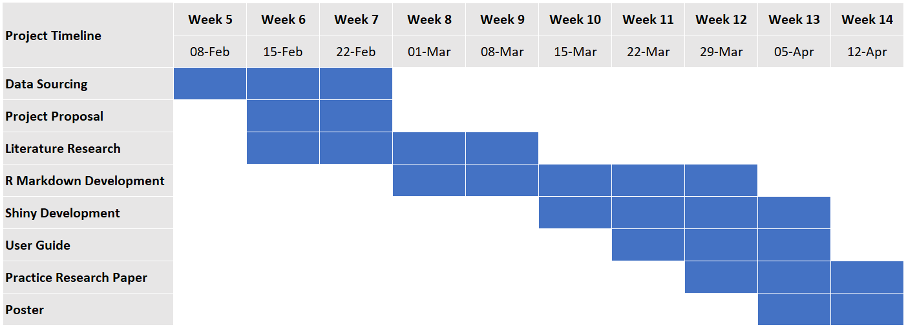
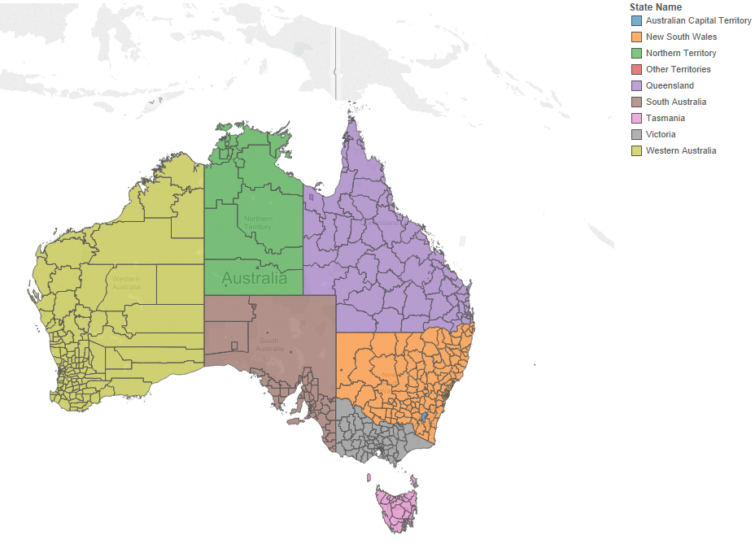
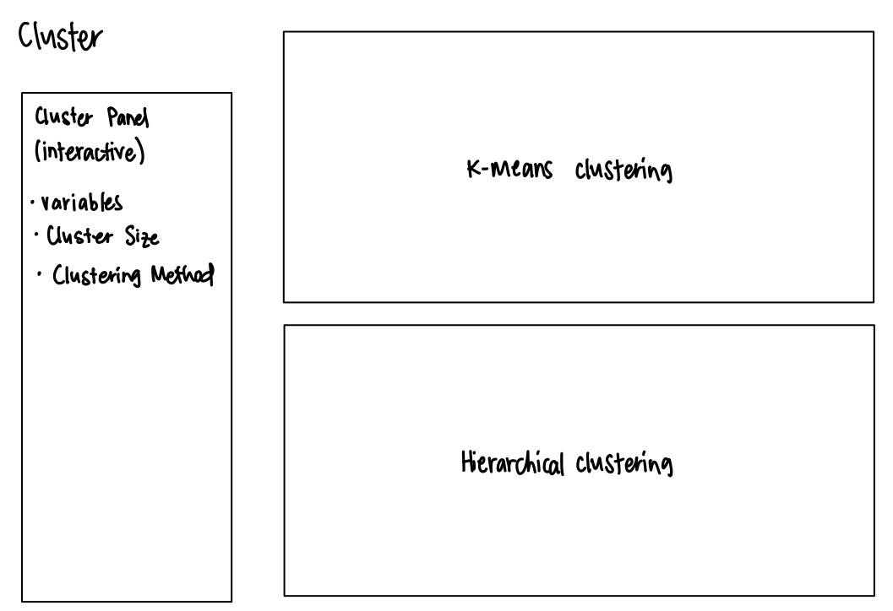
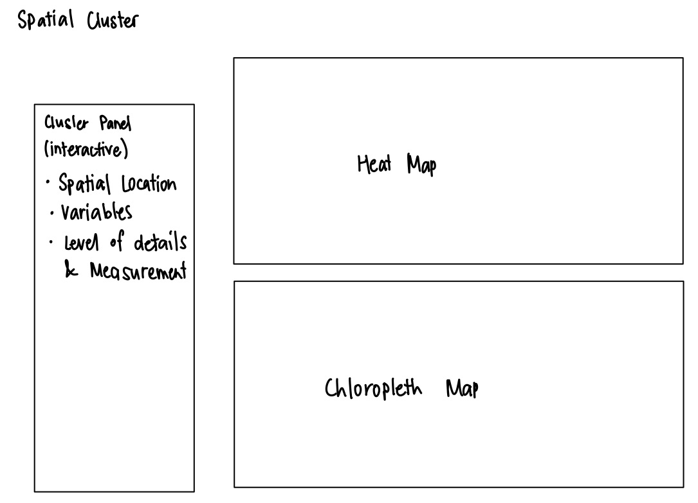
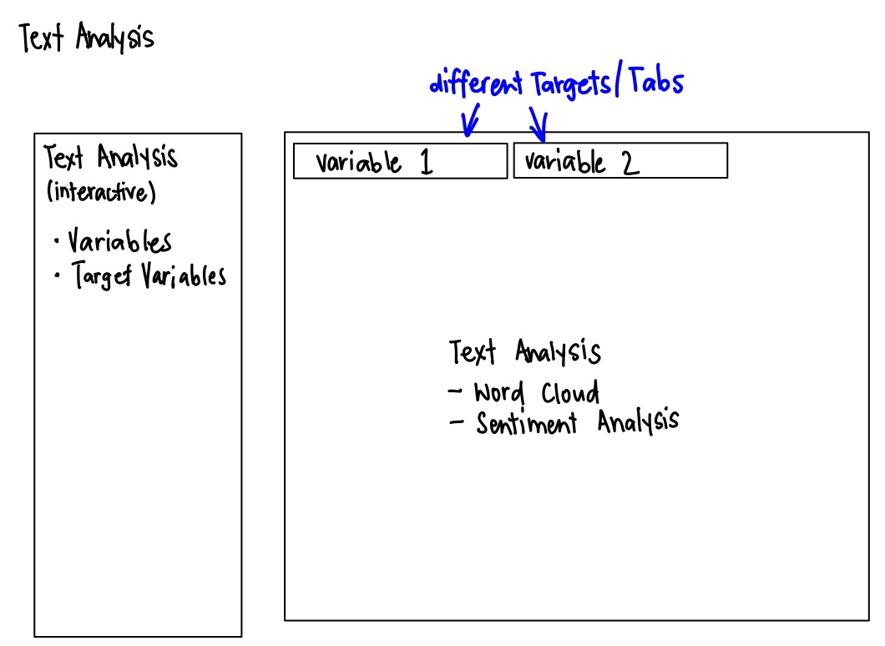
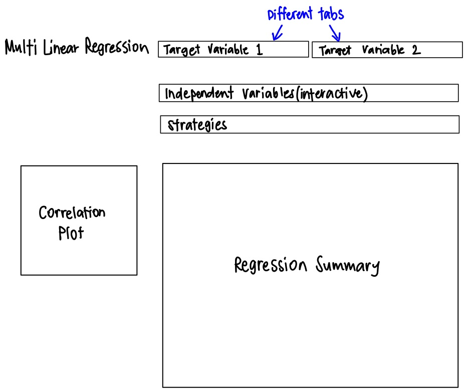

```{r setup, include=FALSE}
knitr::opts_chunk$set(echo = FALSE)
```

# Background
Airbnb, Inc. is one of the most well-known vacation rental platforms in the world. With almost 3 million hosts listing over 7 million accommodations worldwide, 

United States, as the origin of the app, has the largest number of listings at 660,000, with the company having an estimated US$33.8B economic impact on the economy in 2018. Australia - the focus of this project - saw the company having an economic impact of US\$4.4B in the same period, and ranked as the top-10 destination for both inbound and outbound guests, as well as having its cities listed as some of the most popular cities for bookings. In Australia, Airbnb is taking up more than two-thirds of the short-term rental market share. 


Prior to the Covid-19 pandemic, the company was valued at US\$35B but dropped by 48.6% to around \$18B, and the company is estimated to have lost as much as 54% of its revenue in 2020 due to the virus. However, Airbnb's IPO in December 2020 had its valuation topping $100B, indicating optimism in its recovery post-COVID. 

Airbnb is popular with holidaymakers for the wide choice of rental accommodations catering to different needs.Given the popularity of Airbnb to holidaymakers, people are also eager to list their accommodation for vacationers to hire. 

This project provides an analytics platform for interested parties (especially non-data specialists) to conduct statistical analysis on the Australia Airbnb dataset using simple and user-friendly interactive dashboards that does not require programming knowledge. 

# Motivation

The dataset that has be scrapped on the Airbnb web and made publicly available by [Inside Airbnb](http://insideairbnb.com/get-the-data.html) provides geospatial, textual (description of house, house rules, reviews etc.), and quantitative data (per-night price, average ratings, available facilities etc.) on each of the listings listed on the web. 

The abundance of Airbnb data provides great opportunity to conduct a variety of data analyses to understand the residential short-lease rental market. Exploratory data analysis allows broad overview of the short-term residential rental market captured by Airbnb, cluster and geospatial analysis provides a deeper understanding into the different types of dwelling units available on the web, as well as the geographical distribution and patterns of the rental market. Text analysis is also plausible with the rich multitude of textual data made available from the descriptive nature of dataset, to peer into the linguistic association of different attributes of the rental market. Finally, regression analysis complements the other methods to dive deep into the various factors that could crack the code to a successful rental listing and vibrant residential market. 

While there are studies and reports available on these various aspects of the short-lease rental market in the context of individual countries, a prominent short-coming is the lack of publicly and readily accessible data analytic tools for non-specialist to explore unmask the plethora of knowledge beneath. This project hence aims to provide an application for Airbnb hosts, policymakers, or common man and woman alike who are keen on exploring the interesting geospatial, textual, and statistical relationship of the various interacting elements affecting the Airbnb short-term residential rental market. 

While this project focuses on one particular country - Australia - the analytical tools and methods are easily transferable to incorporate datasets from other region, country, or city, subject to the availability of dataset and processing capabilities of the hardware.  


# Project Objectives
* Develop an interactive application for end-users
* Visual representation of accommodation listings by region

# Timeline of Project
Our project timeline will be as follows:

Timeline</br></br></br>

# Proposed Scope and Methodology
This project will focus on Australia as the location of interest.

</br></br>

The methodologies that will be used are:</br>

* Exploratory and Exploratory Spatial Data Analysis (EDA & ESDA)</br>
* Cluster Analysis</br>
* Text Analytics</br>
* Multi-linear Regression</br>

# Application Features
The application will consist of five main sections, one for each analysis approach.
Exploratory Data Analysis</br></br></br>
Cluster Analysis</br></br></br>
Spatial Cluster Analysis</br></br></br>
Text Analysis</br></br></br>
Multilinear Regression Analysis</br>

# Software Tool
Tha interactive application, together with all documentation such as this project proposal and the final report will be written in R using [RStudio](https://rstudio.com/).

# R Packages
These are the R packages used:

**General** 

* DT: https://cran.r-project.org/web/packages/DT
* ggplot2: https://cran.r-project.org/web/packages/ggplot2/index.html
* GGally: https://cran.r-project.org/web/packages/GGally
* leaflet: https://cran.r-project.org/web/packages/leaflet
* lubridate: https://cran.r-project.org/web/packages/lubridate/index.html
* plotly: https://cran.r-project.org/web/packages/plotly
* posterdown: https://cran.r-project.org/web/packages/posterdown
* RColorBrewer: https://cran.r-project.org/web/packages/RColorBrewer
* readr: https://cran.r-project.org/web/packages/readr
* readxl: https://cran.r-project.org/web/packages/readxl
* shiny: https://shiny.rstudio.com
* shinythemes: https://cran.r-project.org/web/packages/shinythemes
* shinyWidgets: https://cran.r-project.org/web/packages/shinyWidgets
* tidyverse: https://www.tidyverse.org
* tmap: https://cran.r-project.org/web/packages/tmap


**Exploratory Data Analytics**

* corrplot: https://cran.r-project.org/web/packages/corrplot
* purr: https://cran.r-project.org/web/packages/purrr/index.html
* rgdal: https://cran.r-project.org/web/packages/rgdal
* rgeos: https://cran.r-project.org/web/packages/rgeos
* sf: https://cran.r-project.org/web/packages/sf
* sp: https://cran.r-project.org/web/packages/sp
* spdep: https://cran.r-project.org/web/packages/spdep

**Cluster Analysis**

* cluster: https://cran.r-project.org/web/packages/cluster/index.html
* dendextend https://cran.r-project.org/web/packages/dendextend
* factoextra: https://cran.r-project.org/web/packages/factoextra/index.html
* ggdendro: https://cran.r-project.org/web/packages/ggdendro

**Text Analysis** 

* quanteda: https://cran.r-project.org/web/packages/quanteda/index.html
* SnowballC: https://cran.r-project.org/web/packages/SnowballC/index.html
* spacyr: https://cran.r-project.org/web/packages/spacyr/index.html
* stringr: https://cran.r-project.org/web/packages/stringr/index.html
* tm: https://cran.r-project.org/web/packages/tm/index.html
* wordcloud: https://cran.r-project.org/web/packages/wordcloud/

**Multilinear Regression**

* MASS: https://cran.r-project.org/web/packages/MASS/index.html


# Team Members
* Louelle TEO Fengmin
* Jason TEY Shou Heng
* WONG Kian Hoong (Andy)

# References
* [2021 Airbnb Statistics: Usage, Demographics, and Revenue Growth](https://www.stratosjets.com/blog/airbnb-statistics/) * [Airbnb, Inc.](https://www.airbnb.com/)
* [Australian region boundaries in Tableau](https://blog.databender.net/2014/08/03/australian-region-boundaries-in-tableau/)
* [Airbnb wins the battle for Australia's short-term rental market](https://www.afr.com/property/residential/airbnb-wins-the-battle-for-australia-s-short-term-rental-market-20190410-p51ctw)
* [Inside Airbnb](http://insideairbnb.com/get-the-data.html)
* [iProperty Management: Airbnb Statistics](https://ipropertymanagement.com/research/airbnb-statistics)