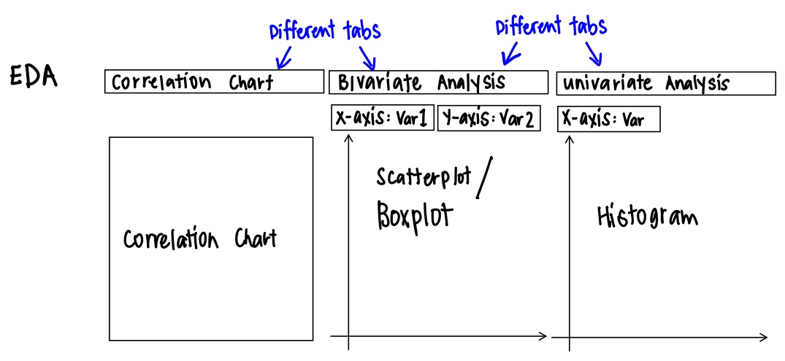

```{r setup, include=FALSE}
knitr::opts_chunk$set(echo = FALSE)
```

# Background
Airbnb, Inc. is one of the most well-known vacation rental platforms in the world. With almost 3 million hosts listing over 7 million accommodations worldwide, airbnb is popular with holidaymakers for the wide availability of rental accommodations.

# Motivation
A common challenge for many hosts is how to price their listing competitively compared to other listings in the same locale. This project aims to provide an application for airbnb hosts to identify whether they their prices are comparative to other accommodations, or too high/low.

The abundance of Airbnb data provides us with a great opportunity to analyse clusters and geospatial clustering of rental units within Australia. It also allows us to review variables that lead towards better reviews and pricing through multilinear regression, and text analysis.

Such analysis could benefit both potential hosts, and also policymakers, to ensure there is a balance between commercial and residential units in the property market.

# Project Objectives
* Develop an interactive application for end-users
* Visual representation of accommodation listings by region

# Timeline of Project
Our project timeline will be as follows

Timeline</br></br></br>

# Proposed Scope and Methodology
This project will focus on Australia as the location of interest.

</br></br>

The methodology that will be used are:</br>

* Exploratory Data Analysis (EDA)</br>
* Cluster Analysis</br>
* Text Analytics</br>
* Development of an R-shiny app with interactive features</br>

# Application Features
The application will consist of five main sections, one for each analysis approach.
Exploratory Data Analysis</br></br></br>
Cluster Analysis</br></br></br>
Spatial Cluster Analysis</br></br></br>
Text Analysis</br></br></br>
Multilinear Regression Analysis</br>

# Software Tool
Tha interactive application, together with all documentation such as this project proposal and the final report will be written in R using [RStudio](https://rstudio.com/).

# R Packages
These are the R packages used:

* ClustGeo: https://cran.r-project.org/web/packages/ClustGeo
* corrplot: https://cran.r-project.org/web/packages/corrplot
* dendextend https://cran.r-project.org/web/packages/dendextend
* DT: https://cran.r-project.org/web/packages/DT
* GGally: https://cran.r-project.org/web/packages/GGally
* ggdendro: https://cran.r-project.org/web/packages/ggdendro
* GWmodel: https://cran.r-project.org/web/packages/GWmodel
* leaflet: https://cran.r-project.org/web/packages/leaflet
* plotly: https://cran.r-project.org/web/packages/plotly
* RColorBrewer: https://cran.r-project.org/web/packages/RColorBrewer
* rgdal: https://cran.r-project.org/web/packages/rgdal
* rgeos: https://cran.r-project.org/web/packages/rgeos
* sf: https://cran.r-project.org/web/packages/sf
* shiny: https://shiny.rstudio.com
* shinythemes: https://cran.r-project.org/web/packages/shinythemes
* shinyWidgets: https://cran.r-project.org/web/packages/shinyWidgets
* sp: https://cran.r-project.org/web/packages/sp
* spdep: https://cran.r-project.org/web/packages/spdep
* tidyverse: https://www.tidyverse.org
* tmap: https://cran.r-project.org/web/packages/tmap

# Team Members
* Jason TEY Shou Heng
* Louelle TEO Fengmin
* WONG Kian Hoong (Andy)

# References
* [Airbnb, Inc.](https://www.airbnb.com/)
* [2021 Airbnb Statistics: Usage, Demographics, and Revenue Growth](https://www.stratosjets.com/blog/airbnb-statistics/) 
* [Australian region boundaries in Tableau](https://blog.databender.net/2014/08/03/australian-region-boundaries-in-tableau/)