```{r, include=FALSE}
options(tinytex.verbose = TRUE)
```

# Exploratory Data Analysis (EDA)
Exploratory Data Analysis allows user to perform initial investigation on the data, so that user can discover correlation patterns and frequency distribution of different variables in the data set. It allows user to formulate hypothesis that forms the foundation for different statistics analysis that could be explored after.

## Bar Charts

Bar charts allow user to explore the total count of relevant variables (e.g. number of hosts) in each geographical division (in this case, State and Local Government Area level)

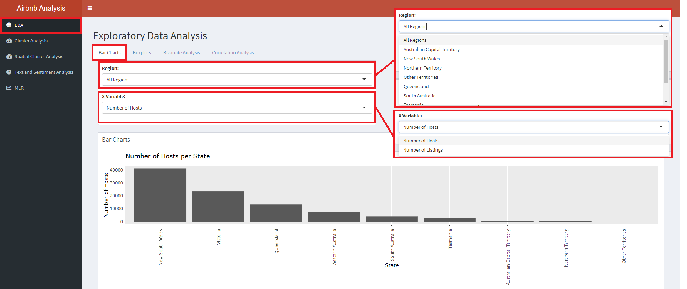{width=100%}


Step 1) Click on *"Region:"* to explore the different states in Australia
Step 2) Click on *"X Variable:"* to select either *"Number of Hosts"* or *"Number of Listings"* as the variable of interest.

The top barchart (see above) showcases the *"X Variable"* (in this case, Number of Hosts) per State and is fixed. 

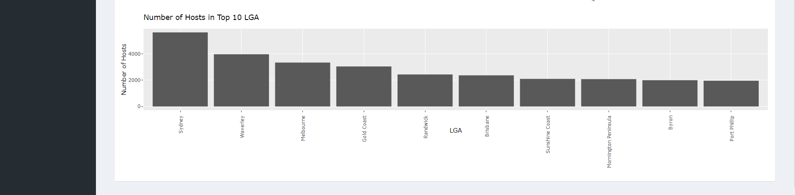{width=100%}

The bottom barchart (see above) showcases the LGAs with the top-10 *"Number of Hosts"* within the selected region.

## Boxplots

Box plots allow users to examine the distribution of selected variable, identifying any extreme outliers or skewness in the distribution. 

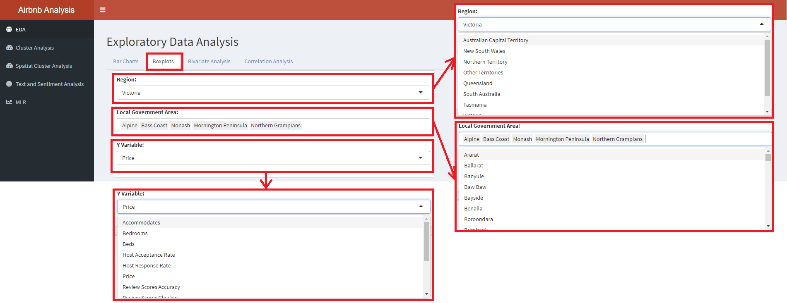{width=100%}

Step 1) Select *"Region:"* to explore the different states in Australia.
Step 2) Click on *"Local Government Area"* to trigger a dropdown list of possible LGAs in the State to include for exploration. Users are able to choose multiple LGAs to view at a single time through clicking the chosen city in the drop down bar.
Step 3) Select *"Y Variable:"* of interest such as *Price, Review Scores Ratings, Bedrooms, Beds* etc. to view the corresponding boxplots

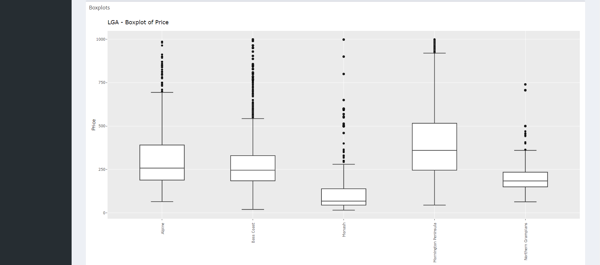{width=100%}

The top boxplot (see above) showcases Boxplots of *"Prices"* in the selected LGAs. Hovering over each boxplot provides more information on the quantile, minimum, and maximum values, 

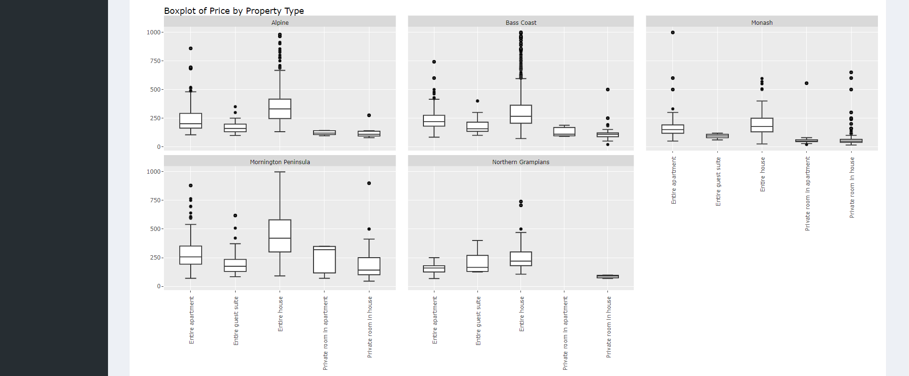{width=100%}

The bottom boxplot (see above) showcases *"Price"* distribution for each *"Property Type"*, facet-wraped by select LGAs. Similarly, hovering over each boxplot provides more information on the quantile, minimum, and maximum values

## Bivariate Analysis

Density plot is an alternative view to the freqeuncy distribution of a selected variable.

Bivariate plot allows user to examine the relationship and visualize any observable correlation between two variables. 

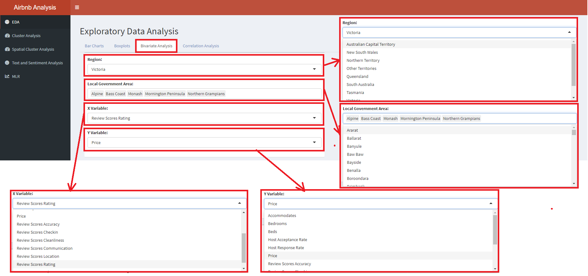{width=100%}

Step 1) Select *"Region:"* to explore the different states in Australia.
Step 2) Click on *"Local Government Area"* to trigger a dropdown list of possible LGAs in the State to include for exploration. Users are able to choose multiple LGAs to view at a single time through clicking the chosen city in the drop down bar.
Step 3  Select *"X Variable:"* of interest to see density plot. 
Step 4) Select *"Y Variable:"* as well to view the bivariate plot between the X- and Y-variable of interest. This will allow user to explore how 2 variables interact with each other

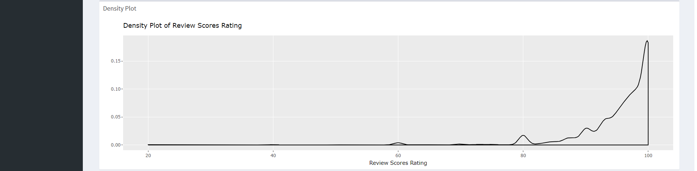{width=100%}

The top plot (see above) is a density plot to showcase the frequency of the *"X Variable"*.

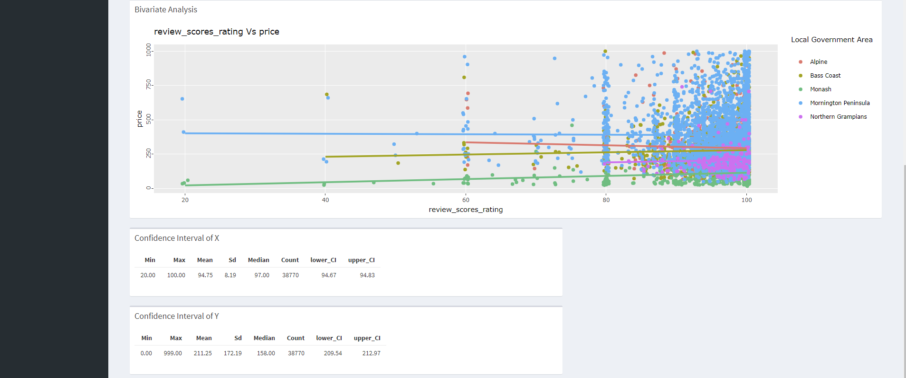{width=100%}

The bottom plot (see above) is a bivariate plot to explore the relationship between two variables. The two tables below the bivariate plots showcase the confidence interval of the *"X Variable"* and *"Y Variable:"*.

## Correlation Analysis

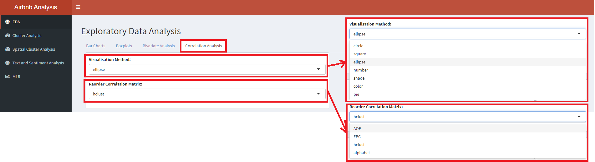{width=100%}

Step 1) Click on *"Visualisation Method:"* to view the correlation plots in different methods such as *"circle, ellipse and number"*.
Step 2) Click on *"Reorder Correlation Matrix:"* to view the correlation plots in different orders such as *"hclust, alphabet and AOE"*.

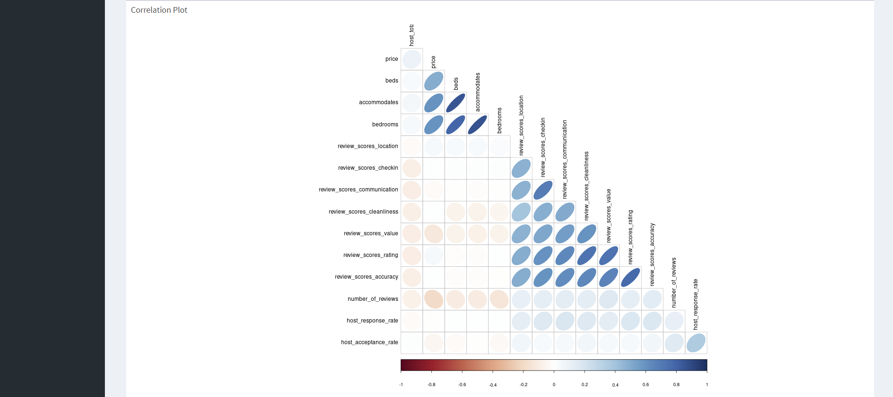{width=100%}

The plot represents the correlation plot of all the variables in the Airbnb data set.

# Cluster Analysis

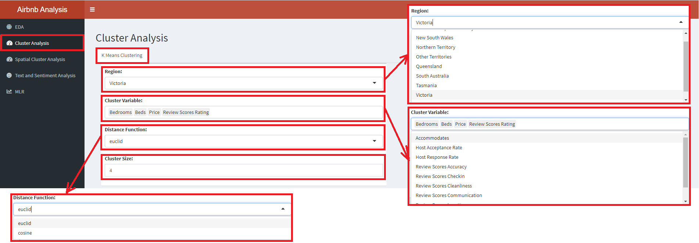{width=100%}

Step 1) Click on *"Region:"* to choose a states in Australia to focus on.
Step 2) Select *"Cluster Variable:"* to include variables for the cluster analysis. Variables include *"Price, Bedrooms, Beds, Review Score Ratings"* etc. 
Step 3) Click on *"Distance Function:"* to choose between *"euclid"* and *"cosine"* distance for the clusters.
Step 4) Toggle *"Cluster Size"* between the sizes 2 and 15, to see different cluster sizes in the data set.

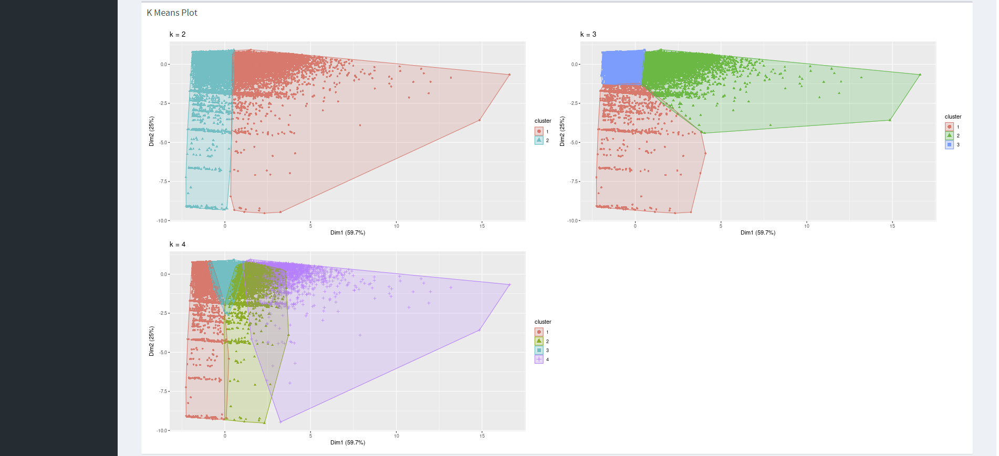{width=100%}

The first plot is the K-Means plot, showcasing clustering with different number of clusters up to the K selected.

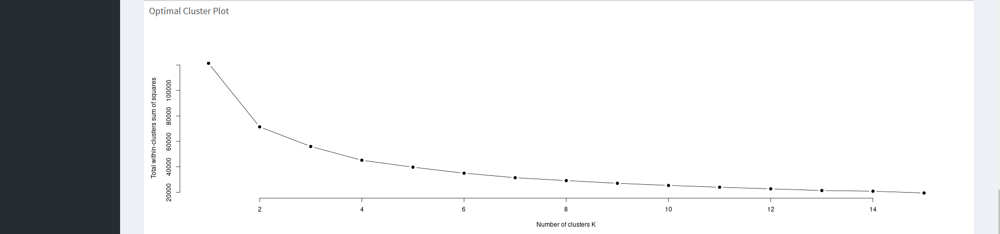{width=100%}

The second plot is an Optimal Cluster Plot, that gives you an indication the number of clusters that will be best for the data set used. Optimal K exists where the kink (change in gradient) is the steepest.

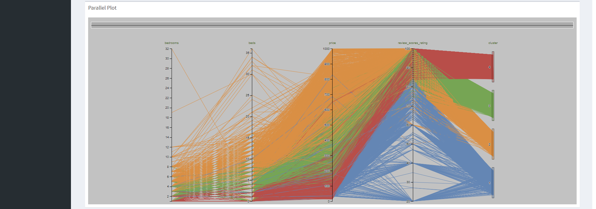{width=100%}

The third plot is a parallel plot that showcases the relationship of the variables and the clusters. It gives an indication of the characteristics of the cluster that was formed.


# Exploratory Spatial Data Visualization and Analysis

This tab can be used for exploratory spatial data visualization and analysis on the Local Government Area (LGA) level for each of the States of Australia.  

Step 1) by clicking on the *Spatial Cluster Analysis* main left-hand panel, we enter this tab, with two maps coming into view (Note: it might take awhile for the viz to load). The left-hand viz provides an overview of the distribution of either the raw values (default) or clustering statistics for the LGAs within a selected area (State) of Australia. The right-hand viz displays the spatial cluster analysis results - showing areas of high/low clusters, and outliers

Step 2) clicking on the drop down list on the *"Select State:"* tab allows users to  select the state of interest from a list of nine different states in Australia (*Note: while the visualization allows for user to select the "All" state option, it is highly discouraged as some of the spatial analyses do not have meaningful interpretations for areas with considerable missing data - for which at the whole-of-Australia level, data are more sparsed. When analyzing the data, users are also advised to conduct due diligence in determining whether the selected data range of interest has sufficiently satisfied analysis requirements.*)  

Step 3) allows users to *"Select Variable"* of interest from a list of six..   

The resultant maps also allow users to click on the area within each contiguous boundary to have more information, such as the name of the LGA, the status (e.g. (C) is a city, (A) an area, (T) towns, (M) municipalities, and (S) shire), and the value of the variable of interest on the first geographical visualization, and the clustering analysis statistics on the second geo-viz on the right. 

{width=100%} 

Step 4) we go on to the options for individual geoviz. For the left-hand viz, user can first select the *reference value* to be displayed - options include raw values and local indicators of spatial association's statistics. Note that if the Moran's I's p-value or the Getis-Ord's G z-scores are selected, selection for other options (see step 4 and 5 below) will be disabled as these statistical results are to be interpreted on pre-determined intervals.  

Step 5) allows user to select the *binning methods* - in other words, how should the values be split up, be it by equal intervals, by natural breaks (Jenks' and Fisher's), standard deviation bins, etc. A total of 10 options are available under the drop-down. 

Step 6) allows user to select the *number of intervals* to have - i.e. how many different classes should the data be split into. User can shift the slider manually to select the desired class. Note that the selection is very critical (compulsory) for classification methods such as the K-Mean selection; practical for methods such as Equal, Pretty, Jenks and Fisher; but not as useful for methods such as log10 Pretty or even standard deviation.  

Step 7) on the right-hand viz, user can select variables to alter the clustering parameters. Firstly, the level of confidence - i.e. how much confidence do we need to reject the null hypothesis that there are no spatial clustering/outlier at the areas identified to have such cluster/outlier.   

Step 8) there are also different methods to select the definition of 'neighbor' - this can be selected by changing the *"Analysis methods:"* panel options. Note that if "K Nearest Neighbors" is selected, an additional slider requesting user to input the number of nearest neighbors to be considered will appear. Same thing, if "Distance" is selected, a slider to select the distance radius to be considered neighbor will appear as well. 

{width=100%} 

# Sentiment Analysis
The sentiment analysis module of this Shiny app includes two analysis models: a word cloud and a topic model.

## Word Cloud  

Step 1) Click on *Text and Sentiment Analysis* to open the module.

Step 2) Select the range of *Review score ratings* that user wants to focus on. By default, all scores will be included.

Step 3) Select the *Region* of focus. In this case, it is Victoria.

The word cloud will be generated. The size of the font represents the relative frequency of the word in the description section of Airbnb listings that fall in the category of the filter settings above (the word in the largest font is the most common word).

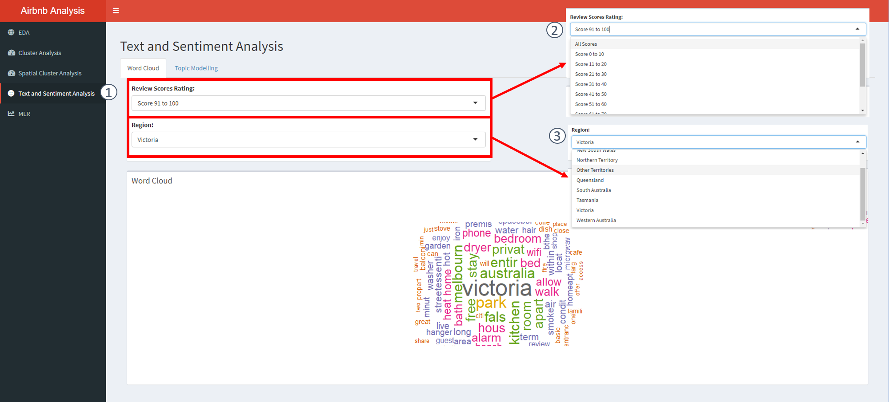{width=100%}

## Topic Modelling  

Topic modeling is an unsupervised machine learning technique that detects word and phrase patterns in documents and clusters them into groups known as topics.

Latent Dirichlet Allocation (LDA) is one common topic modeling technique. The basic assumption of LDA is that similar topics make use of similar words (i.e. distributional hypothesis). The purpose of LDA is to map the corpus to topics covering a significant number of words in the documents in the corpus.

LDA assigns topics to arrangements of words for example, the best word for a topic related to accommodation. This is based on the assumption that documents are written with a certain arrangement of words and that those arrangements will determine the topics. LDA assumes that all words in the document can be assigned a probability of belonging to a topic. As such, the goal of LDA is to determine the mixture of topics that a document contains.

The navigation is similar to the Word Cloud pane.

Step 1) Select the *"Topic Modelling* tab under the *Text and Sentiment Analysis* panel tab to open the module.

Step 2) Select the *Range* of review score ratings that user wants to focus on. By default, all scores will be included.

Step 3) Select the *Region* of focus. In this case, it is Victoria.

Step 4) Enter the *number of topics* user wants to identify. The default is three topics.

Step 5) Enter the *number of words* user would like to have displayed for each topic. The default is 10 words.

The LDA topic model will be generated. The bar beside the corresponding word represents the probability (beta) of that word appearing in that particular topic. The longer the bar, the higher the probability.

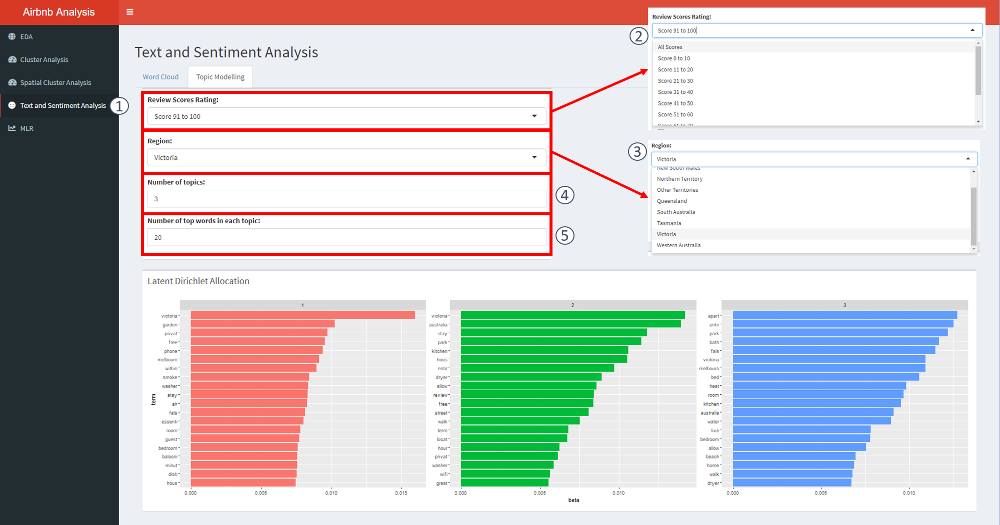{width=100%}

# Multiple Linear Regression

## Regression for Price

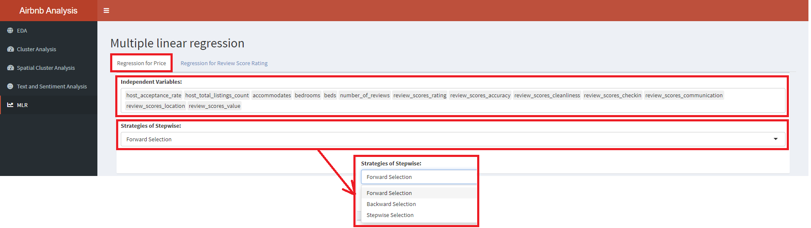{width=100%}

At the *"Regression for Price"* tab,

Step 1) Click on *"Independent Variables:"* to choose the multiple variables that you would like to apply in the Multiple Linear Regression (MLR). The choices of variables could be influenced through the correlation plot found in the EDA. Users are encouraged to choose variables with low correlation with each other.
Step 2) Click on *"Strategies of Stepwise:"* to choose whether the Stepwise MLR will move in a *"Forward", "Backward",* or *"Stepwise"* direction.

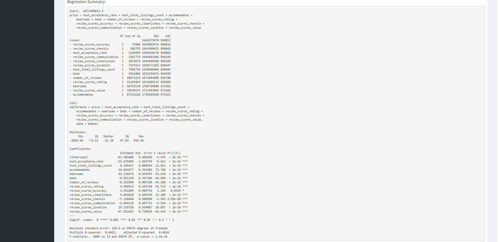{width=100%}

The *"Regression Summary"* showcases the MLR calculation and gives us an indication of the significance of each variable in the regression with respect to *"Price"*.

## Regression for Review Score Ratings

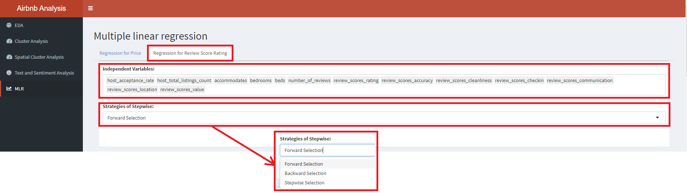{width=100%}

At the *"Regression for Review Score Rating"* tab,

Step 1) Click on *"Independent Variables:"* to choose the multiple variables that you would like to apply in the Multiple Linear Regression (MLR). The choices of variables could be influenced through the correlation plot found in the EDA. It is better to choose variables with low correlation with each other.
Step 2) Click on *"Strategies of Stepwise:"* to choose whether the Stepwise MLR will move in a *"Forward", "Backward",* or *"Stepwise"* direction.

The *"Regression Summary"* showcases the MLR calculation and gives us an indication of the significance of each variable in the regression with respect to *"Review Score Ratings"*.